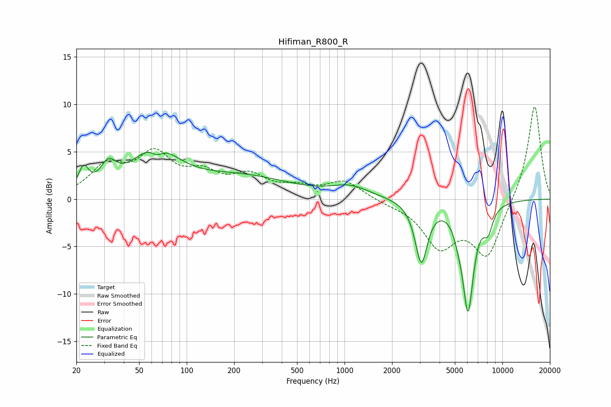

# Hifiman_R800_R
See [usage instructions](https://github.com/jaakkopasanen/AutoEq#usage) for more options and info.

### Parametric EQs
Apply preamp of -5.0 dB when using parametric equalizer.

|   # | Type    |   Fc (Hz) |    Q |   Gain (dB) |
|-----|---------|-----------|------|-------------|
|   1 | Peaking |        22 | 4.47 |         2.3 |
|   2 | Peaking |        32 | 2.97 |         2.3 |
|   3 | Peaking |        63 | 0.97 |         4.8 |
|   4 | Peaking |        65 | 3.77 |        -1   |
|   5 | Peaking |       224 | 0.45 |         2.2 |
|   6 | Peaking |      1090 | 1.18 |         1.1 |
|   7 | Peaking |      3065 | 3.65 |        -6.4 |
|   8 | Peaking |      5264 | 4.92 |        -0.9 |
|   9 | Peaking |      6060 | 3.78 |       -11.2 |
|  10 | Peaking |      8102 | 4.41 |        -2.2 |

### Fixed Band EQs
When using fixed band (also called graphic) equalizer, apply preamp of **-9.8 dB** (if available) and set gains manually with these parameters.

|   # | Type    |   Fc (Hz) |    Q |   Gain (dB) |
|-----|---------|-----------|------|-------------|
|   1 | Peaking |        31 | 1.41 |         3.2 |
|   2 | Peaking |        62 | 1.41 |         4.3 |
|   3 | Peaking |       125 | 1.41 |         2.2 |
|   4 | Peaking |       250 | 1.41 |         2.1 |
|   5 | Peaking |       500 | 1.41 |         1   |
|   6 | Peaking |      1000 | 1.41 |         1.8 |
|   7 | Peaking |      2000 | 1.41 |        -0.3 |
|   8 | Peaking |      4000 | 1.41 |        -4.7 |
|   9 | Peaking |      8000 | 1.41 |        -5.9 |
|  10 | Peaking |     16000 | 1.41 |        10.1 |

### Graphs

