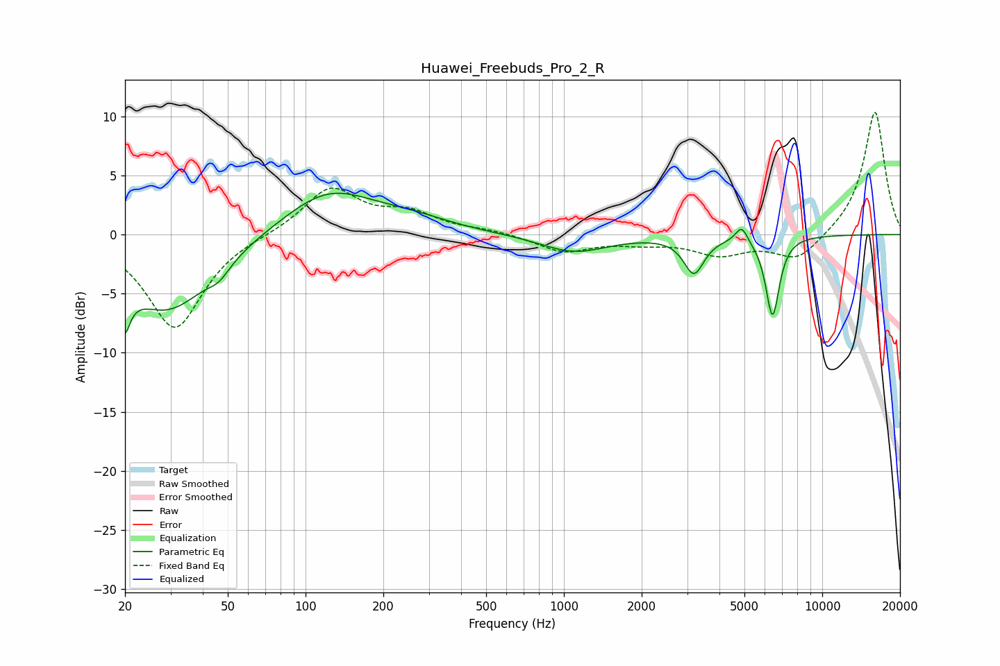

# Huawei_Freebuds_Pro_2_R
See [usage instructions](https://github.com/jaakkopasanen/AutoEq#usage) for more options and info.

### Parametric EQs
Apply preamp of -3.6 dB when using parametric equalizer.

|   # | Type    |   Fc (Hz) |    Q |   Gain (dB) |
|-----|---------|-----------|------|-------------|
|   1 | Peaking |        20 | 5.81 |        -7.1 |
|   2 | Peaking |        20 | 6    |         3.1 |
|   3 | Peaking |        29 | 0.83 |        -6.4 |
|   4 | Peaking |        46 | 3.35 |        -1   |
|   5 | Peaking |       122 | 0.8  |         3.8 |
|   6 | Peaking |       259 | 0.9  |         0.9 |
|   7 | Peaking |      1094 | 1.09 |        -1.5 |
|   8 | Peaking |      3186 | 3.64 |        -3.1 |
|   9 | Peaking |      4876 | 6    |         1.4 |
|  10 | Peaking |      6421 | 5.15 |        -6.8 |

### Fixed Band EQs
When using fixed band (also called graphic) equalizer, apply preamp of **-10.4 dB** (if available) and set gains manually with these parameters.

|   # | Type    |   Fc (Hz) |    Q |   Gain (dB) |
|-----|---------|-----------|------|-------------|
|   1 | Peaking |        31 | 1.41 |        -8   |
|   2 | Peaking |        62 | 1.41 |         0.1 |
|   3 | Peaking |       125 | 1.41 |         3.9 |
|   4 | Peaking |       250 | 1.41 |         1.6 |
|   5 | Peaking |       500 | 1.41 |         0.3 |
|   6 | Peaking |      1000 | 1.41 |        -1.4 |
|   7 | Peaking |      2000 | 1.41 |        -0.5 |
|   8 | Peaking |      4000 | 1.41 |        -1.6 |
|   9 | Peaking |      8000 | 1.41 |        -2.2 |
|  10 | Peaking |     16000 | 1.41 |        10.5 |

### Graphs

