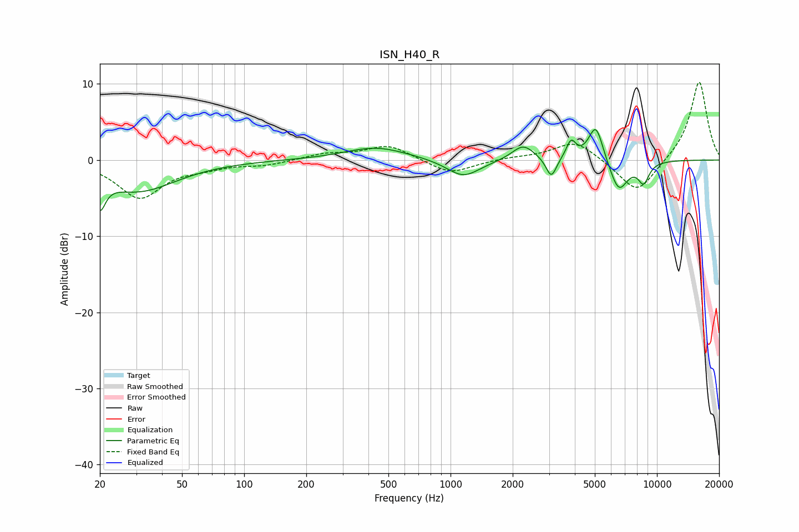

# ISN_H40_R
See [usage instructions](https://github.com/jaakkopasanen/AutoEq#usage) for more options and info.

### Parametric EQs
Apply preamp of -4.1 dB when using parametric equalizer.

|   # | Type    |   Fc (Hz) |    Q |   Gain (dB) |
|-----|---------|-----------|------|-------------|
|   1 | Peaking |        20 | 5.41 |        -3.9 |
|   2 | Peaking |        31 | 0.76 |        -4   |
|   3 | Peaking |       435 | 0.93 |         1.7 |
|   4 | Peaking |      1153 | 1.75 |        -2.4 |
|   5 | Peaking |      2248 | 2.62 |         2.1 |
|   6 | Peaking |      3076 | 5.56 |        -2.7 |
|   7 | Peaking |      3837 | 6    |         2.3 |
|   8 | Peaking |      5058 | 3.88 |         4.9 |
|   9 | Peaking |      6526 | 3.07 |        -4.2 |
|  10 | Peaking |      8613 | 4.78 |        -2.6 |

### Fixed Band EQs
When using fixed band (also called graphic) equalizer, apply preamp of **-10.3 dB** (if available) and set gains manually with these parameters.

|   # | Type    |   Fc (Hz) |    Q |   Gain (dB) |
|-----|---------|-----------|------|-------------|
|   1 | Peaking |        31 | 1.41 |        -4.9 |
|   2 | Peaking |        62 | 1.41 |        -0.7 |
|   3 | Peaking |       125 | 1.41 |        -0.6 |
|   4 | Peaking |       250 | 1.41 |         0.8 |
|   5 | Peaking |       500 | 1.41 |         2   |
|   6 | Peaking |      1000 | 1.41 |        -1.9 |
|   7 | Peaking |      2000 | 1.41 |         0.3 |
|   8 | Peaking |      4000 | 1.41 |         2.6 |
|   9 | Peaking |      8000 | 1.41 |        -4.6 |
|  10 | Peaking |     16000 | 1.41 |        10.5 |

### Graphs

