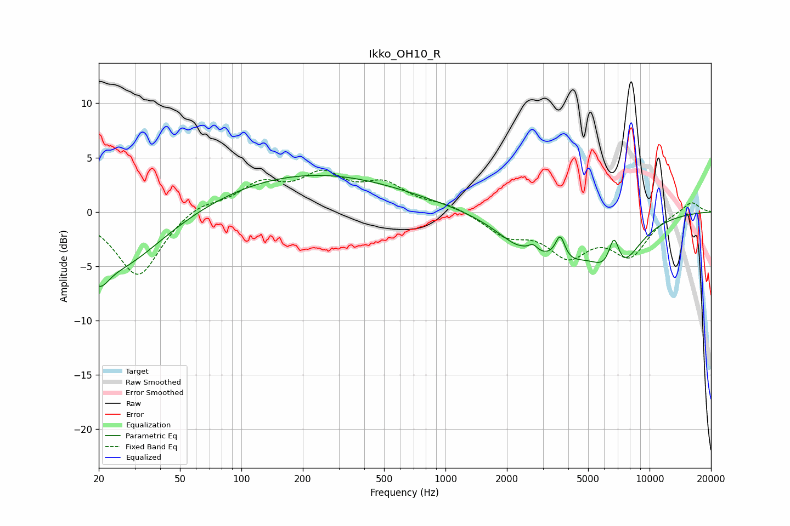

# Ikko_OH10_R
See [usage instructions](https://github.com/jaakkopasanen/AutoEq#usage) for more options and info.

### Parametric EQs
Apply preamp of -3.5 dB when using parametric equalizer.

|   # | Type    |   Fc (Hz) |    Q |   Gain (dB) |
|-----|---------|-----------|------|-------------|
|   1 | Peaking |        20 | 2.96 |        -2.5 |
|   2 | Peaking |        25 | 0.67 |        -5.1 |
|   3 | Peaking |       218 | 0.31 |         3.5 |
|   4 | Peaking |      2382 | 5.87 |         0.1 |
|   5 | Peaking |      2472 | 1.05 |        -2.9 |
|   6 | Peaking |      2679 | 6    |         0.8 |
|   7 | Peaking |      3649 | 6    |         2.3 |
|   8 | Peaking |      3940 | 1.42 |        -2.1 |
|   9 | Peaking |      6695 | 4.74 |         3.7 |
|  10 | Peaking |      6795 | 1.33 |        -5.5 |

### Fixed Band EQs
When using fixed band (also called graphic) equalizer, apply preamp of **-3.9 dB** (if available) and set gains manually with these parameters.

|   # | Type    |   Fc (Hz) |    Q |   Gain (dB) |
|-----|---------|-----------|------|-------------|
|   1 | Peaking |        31 | 1.41 |        -6   |
|   2 | Peaking |        62 | 1.41 |         0.9 |
|   3 | Peaking |       125 | 1.41 |         2.3 |
|   4 | Peaking |       250 | 1.41 |         3   |
|   5 | Peaking |       500 | 1.41 |         2.3 |
|   6 | Peaking |      1000 | 1.41 |         0.7 |
|   7 | Peaking |      2000 | 1.41 |        -1.9 |
|   8 | Peaking |      4000 | 1.41 |        -3.6 |
|   9 | Peaking |      8000 | 1.41 |        -3.7 |
|  10 | Peaking |     16000 | 1.41 |         1   |

### Graphs

