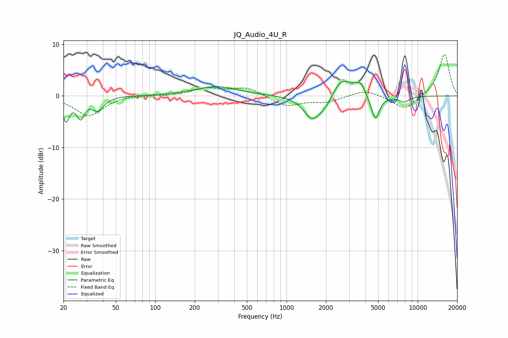

# JQ_Audio_4U_R
See [usage instructions](https://github.com/jaakkopasanen/AutoEq#usage) for more options and info.

### Parametric EQs
Apply preamp of -3.0 dB when using parametric equalizer.

|   # | Type    |   Fc (Hz) |    Q |   Gain (dB) |
|-----|---------|-----------|------|-------------|
|   1 | Peaking |        21 | 5.61 |        -4.4 |
|   2 | Peaking |        27 | 4.61 |        -3.8 |
|   3 | Peaking |        37 | 3.34 |        -2.5 |
|   4 | Peaking |       293 | 0.86 |         1.8 |
|   5 | Peaking |      1568 | 2.2  |        -4.5 |
|   6 | Peaking |      1974 | 2.93 |        -1.7 |
|   7 | Peaking |      2661 | 1.93 |         3.7 |
|   8 | Peaking |      3637 | 3.92 |         2.2 |
|   9 | Peaking |      4758 | 4.32 |        -4.8 |
|  10 | Peaking |      7856 | 3.25 |        -1.1 |

### Fixed Band EQs
When using fixed band (also called graphic) equalizer, apply preamp of **-8.1 dB** (if available) and set gains manually with these parameters.

|   # | Type    |   Fc (Hz) |    Q |   Gain (dB) |
|-----|---------|-----------|------|-------------|
|   1 | Peaking |        31 | 1.41 |        -3.9 |
|   2 | Peaking |        62 | 1.41 |         0.3 |
|   3 | Peaking |       125 | 1.41 |        -0   |
|   4 | Peaking |       250 | 1.41 |         1.4 |
|   5 | Peaking |       500 | 1.41 |         1.6 |
|   6 | Peaking |      1000 | 1.41 |        -2   |
|   7 | Peaking |      2000 | 1.41 |        -1.1 |
|   8 | Peaking |      4000 | 1.41 |         1.3 |
|   9 | Peaking |      8000 | 1.41 |        -2.8 |
|  10 | Peaking |     16000 | 1.41 |         8.2 |

### Graphs

