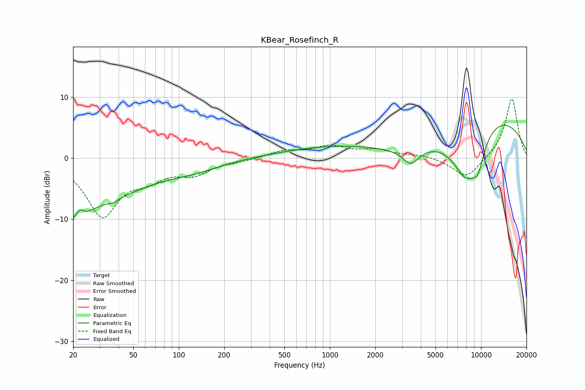

# KBear_Rosefinch_R
See [usage instructions](https://github.com/jaakkopasanen/AutoEq#usage) for more options and info.

### Parametric EQs
Apply preamp of -5.5 dB when using parametric equalizer.

|   # | Type    |   Fc (Hz) |    Q |   Gain (dB) |
|-----|---------|-----------|------|-------------|
|   1 | Peaking |        20 | 0.33 |        -7.9 |
|   2 | Peaking |        21 | 2.87 |        -3.7 |
|   3 | Peaking |        22 | 5.01 |         2.9 |
|   4 | Peaking |        37 | 5.32 |        -0.4 |
|   5 | Peaking |       129 | 0.81 |        -1.2 |
|   6 | Peaking |      3295 | 0.34 |        -9.8 |
|   7 | Peaking |      3437 | 2.6  |        -2.6 |
|   8 | Peaking |      5185 | 0.18 |        13.1 |
|   9 | Peaking |      7948 | 1.35 |        -8.4 |
|  10 | Peaking |      9556 | 2.95 |        -3.9 |

### Fixed Band EQs
When using fixed band (also called graphic) equalizer, apply preamp of **-9.8 dB** (if available) and set gains manually with these parameters.

|   # | Type    |   Fc (Hz) |    Q |   Gain (dB) |
|-----|---------|-----------|------|-------------|
|   1 | Peaking |        31 | 1.41 |        -9.2 |
|   2 | Peaking |        62 | 1.41 |        -2.5 |
|   3 | Peaking |       125 | 1.41 |        -2.3 |
|   4 | Peaking |       250 | 1.41 |        -0.4 |
|   5 | Peaking |       500 | 1.41 |         1.1 |
|   6 | Peaking |      1000 | 1.41 |         1.8 |
|   7 | Peaking |      2000 | 1.41 |         1.2 |
|   8 | Peaking |      4000 | 1.41 |         0.5 |
|   9 | Peaking |      8000 | 1.41 |        -3.4 |
|  10 | Peaking |     16000 | 1.41 |         9.9 |

### Graphs

