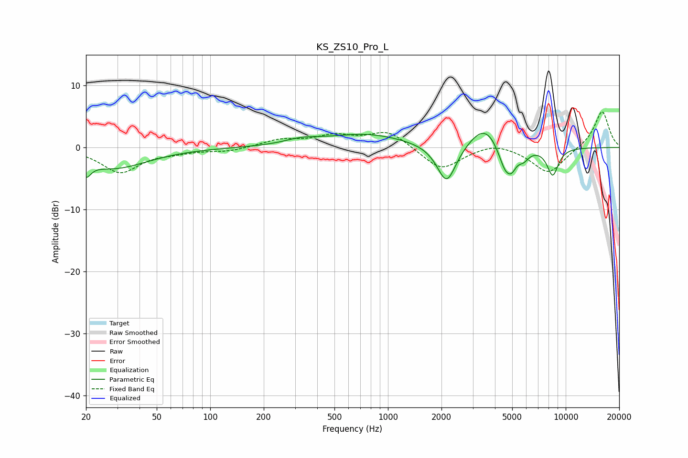

# KS_ZS10_Pro_L
See [usage instructions](https://github.com/jaakkopasanen/AutoEq#usage) for more options and info.

### Parametric EQs
Apply preamp of -2.4 dB when using parametric equalizer.

|   # | Type    |   Fc (Hz) |    Q |   Gain (dB) |
|-----|---------|-----------|------|-------------|
|   1 | Peaking |        20 | 5.32 |        -2.3 |
|   2 | Peaking |        29 | 0.73 |        -3.3 |
|   3 | Peaking |       326 | 1.49 |         0.8 |
|   4 | Peaking |       751 | 0.63 |         2.1 |
|   5 | Peaking |      2139 | 2.6  |        -6.5 |
|   6 | Peaking |      3503 | 1.65 |         3.9 |
|   7 | Peaking |      4570 | 3.49 |        -4.2 |
|   8 | Peaking |      4980 | 5.24 |        -1.9 |
|   9 | Peaking |      5782 | 4.27 |        -1.5 |
|  10 | Peaking |      8453 | 4.03 |        -4.4 |

### Fixed Band EQs
When using fixed band (also called graphic) equalizer, apply preamp of **-5.8 dB** (if available) and set gains manually with these parameters.

|   # | Type    |   Fc (Hz) |    Q |   Gain (dB) |
|-----|---------|-----------|------|-------------|
|   1 | Peaking |        31 | 1.41 |        -4   |
|   2 | Peaking |        62 | 1.41 |        -0.6 |
|   3 | Peaking |       125 | 1.41 |        -0.6 |
|   4 | Peaking |       250 | 1.41 |         1.2 |
|   5 | Peaking |       500 | 1.41 |         1.7 |
|   6 | Peaking |      1000 | 1.41 |         2.7 |
|   7 | Peaking |      2000 | 1.41 |        -3.7 |
|   8 | Peaking |      4000 | 1.41 |         1   |
|   9 | Peaking |      8000 | 1.41 |        -4.2 |
|  10 | Peaking |     16000 | 1.41 |         6   |

### Graphs

