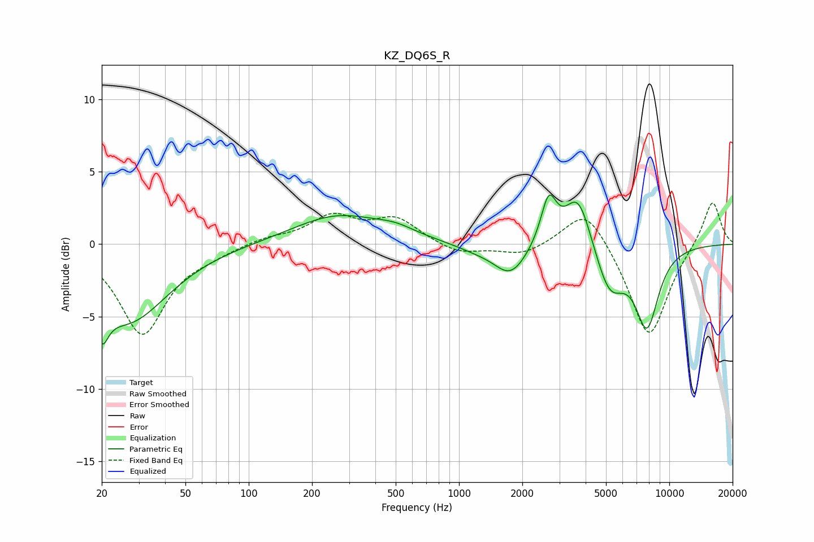

# KZ_DQ6S_R
See [usage instructions](https://github.com/jaakkopasanen/AutoEq#usage) for more options and info.

### Parametric EQs
Apply preamp of -3.5 dB when using parametric equalizer.

|   # | Type    |   Fc (Hz) |    Q |   Gain (dB) |
|-----|---------|-----------|------|-------------|
|   1 | Peaking |        20 | 4.72 |        -2.4 |
|   2 | Peaking |        26 | 0.74 |        -5.3 |
|   3 | Peaking |       265 | 0.67 |         2   |
|   4 | Peaking |       500 | 1.5  |         0.5 |
|   5 | Peaking |      1187 | 1.46 |        -0.4 |
|   6 | Peaking |      1759 | 1.78 |        -2.2 |
|   7 | Peaking |      2670 | 3.81 |         3.2 |
|   8 | Peaking |      3690 | 2.2  |         3.9 |
|   9 | Peaking |      5199 | 1.98 |        -3.3 |
|  10 | Peaking |      7831 | 2.37 |        -5.3 |

### Fixed Band EQs
When using fixed band (also called graphic) equalizer, apply preamp of **-2.9 dB** (if available) and set gains manually with these parameters.

|   # | Type    |   Fc (Hz) |    Q |   Gain (dB) |
|-----|---------|-----------|------|-------------|
|   1 | Peaking |        31 | 1.41 |        -6.2 |
|   2 | Peaking |        62 | 1.41 |        -0.5 |
|   3 | Peaking |       125 | 1.41 |         0.4 |
|   4 | Peaking |       250 | 1.41 |         1.8 |
|   5 | Peaking |       500 | 1.41 |         1.7 |
|   6 | Peaking |      1000 | 1.41 |        -0.7 |
|   7 | Peaking |      2000 | 1.41 |        -0.8 |
|   8 | Peaking |      4000 | 1.41 |         2.8 |
|   9 | Peaking |      8000 | 1.41 |        -6.6 |
|  10 | Peaking |     16000 | 1.41 |         3.2 |

### Graphs

