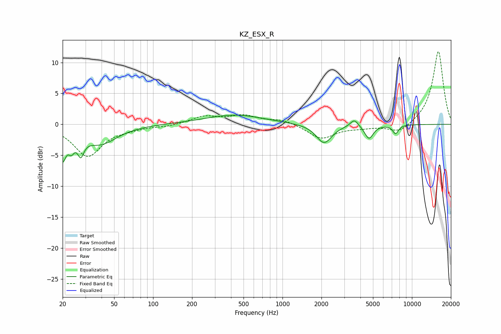

# KZ_ESX_R
See [usage instructions](https://github.com/jaakkopasanen/AutoEq#usage) for more options and info.

### Parametric EQs
Apply preamp of -1.6 dB when using parametric equalizer.

|   # | Type    |   Fc (Hz) |    Q |   Gain (dB) |
|-----|---------|-----------|------|-------------|
|   1 | Peaking |        20 | 5.74 |        -4.5 |
|   2 | Peaking |        23 | 5.93 |        -2.1 |
|   3 | Peaking |        28 | 6    |         1.5 |
|   4 | Peaking |        28 | 5.8  |        -4.3 |
|   5 | Peaking |        39 | 1.1  |        -3.1 |
|   6 | Peaking |       424 | 0.63 |         1.5 |
|   7 | Peaking |      2094 | 2.38 |        -3.1 |
|   8 | Peaking |      3592 | 4.59 |         1.2 |
|   9 | Peaking |      4658 | 4.23 |        -2.2 |
|  10 | Peaking |      7475 | 6    |        -1.4 |

### Fixed Band EQs
When using fixed band (also called graphic) equalizer, apply preamp of **-11.8 dB** (if available) and set gains manually with these parameters.

|   # | Type    |   Fc (Hz) |    Q |   Gain (dB) |
|-----|---------|-----------|------|-------------|
|   1 | Peaking |        31 | 1.41 |        -5.1 |
|   2 | Peaking |        62 | 1.41 |        -0.5 |
|   3 | Peaking |       125 | 1.41 |        -0.3 |
|   4 | Peaking |       250 | 1.41 |         1.2 |
|   5 | Peaking |       500 | 1.41 |         1.3 |
|   6 | Peaking |      1000 | 1.41 |         0.8 |
|   7 | Peaking |      2000 | 1.41 |        -2.3 |
|   8 | Peaking |      4000 | 1.41 |        -0.4 |
|   9 | Peaking |      8000 | 1.41 |        -1.5 |
|  10 | Peaking |     16000 | 1.41 |        11.9 |

### Graphs

