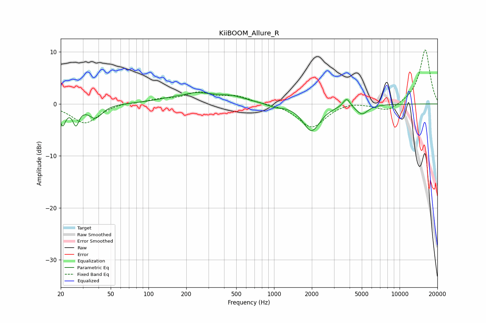

# KiiBOOM_Allure_R
See [usage instructions](https://github.com/jaakkopasanen/AutoEq#usage) for more options and info.

### Parametric EQs
Apply preamp of -2.3 dB when using parametric equalizer.

|   # | Type    |   Fc (Hz) |    Q |   Gain (dB) |
|-----|---------|-----------|------|-------------|
|   1 | Peaking |        21 | 5.78 |        -3.7 |
|   2 | Peaking |        26 | 5.72 |        -3.4 |
|   3 | Peaking |        38 | 2.66 |        -2.6 |
|   4 | Peaking |       189 | 1.95 |        -0.6 |
|   5 | Peaking |       215 | 0.91 |         2.3 |
|   6 | Peaking |       459 | 1.19 |         1.1 |
|   7 | Peaking |      1008 | 2.83 |        -0.5 |
|   8 | Peaking |      1987 | 2.09 |        -5.2 |
|   9 | Peaking |      3791 | 4.93 |         1.8 |
|  10 | Peaking |      5009 | 2.96 |        -1.9 |

### Fixed Band EQs
When using fixed band (also called graphic) equalizer, apply preamp of **-10.5 dB** (if available) and set gains manually with these parameters.

|   # | Type    |   Fc (Hz) |    Q |   Gain (dB) |
|-----|---------|-----------|------|-------------|
|   1 | Peaking |        31 | 1.41 |        -3.7 |
|   2 | Peaking |        62 | 1.41 |         0.3 |
|   3 | Peaking |       125 | 1.41 |         0.8 |
|   4 | Peaking |       250 | 1.41 |         2   |
|   5 | Peaking |       500 | 1.41 |         1.4 |
|   6 | Peaking |      1000 | 1.41 |         0   |
|   7 | Peaking |      2000 | 1.41 |        -4.6 |
|   8 | Peaking |      4000 | 1.41 |         0.5 |
|   9 | Peaking |      8000 | 1.41 |        -1.6 |
|  10 | Peaking |     16000 | 1.41 |        10.5 |

### Graphs

