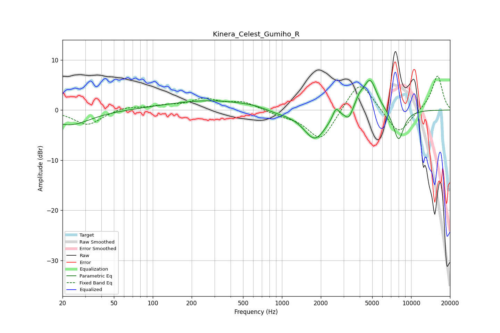

# Kinera_Celest_Gumiho_R
See [usage instructions](https://github.com/jaakkopasanen/AutoEq#usage) for more options and info.

### Parametric EQs
Apply preamp of -6.0 dB when using parametric equalizer.

|   # | Type    |   Fc (Hz) |    Q |   Gain (dB) |
|-----|---------|-----------|------|-------------|
|   1 | Peaking |        23 | 0.91 |        -3   |
|   2 | Peaking |       275 | 0.42 |         1.9 |
|   3 | Peaking |       618 | 1.22 |         0.3 |
|   4 | Peaking |       918 | 1.33 |        -0.7 |
|   5 | Peaking |      1798 | 1.61 |        -5.9 |
|   6 | Peaking |      2618 | 5.95 |         2.1 |
|   7 | Peaking |      3289 | 4.84 |        -1.9 |
|   8 | Peaking |      3990 | 4.21 |         1.6 |
|   9 | Peaking |      4815 | 2.62 |         6.3 |
|  10 | Peaking |      7991 | 3.11 |        -6.2 |

### Fixed Band EQs
When using fixed band (also called graphic) equalizer, apply preamp of **-6.9 dB** (if available) and set gains manually with these parameters.

|   # | Type    |   Fc (Hz) |    Q |   Gain (dB) |
|-----|---------|-----------|------|-------------|
|   1 | Peaking |        31 | 1.41 |        -3   |
|   2 | Peaking |        62 | 1.41 |         0.7 |
|   3 | Peaking |       125 | 1.41 |         0.7 |
|   4 | Peaking |       250 | 1.41 |         2   |
|   5 | Peaking |       500 | 1.41 |         1.6 |
|   6 | Peaking |      1000 | 1.41 |        -0.8 |
|   7 | Peaking |      2000 | 1.41 |        -6.3 |
|   8 | Peaking |      4000 | 1.41 |         6.4 |
|   9 | Peaking |      8000 | 1.41 |        -5.1 |
|  10 | Peaking |     16000 | 1.41 |         7   |

### Graphs

