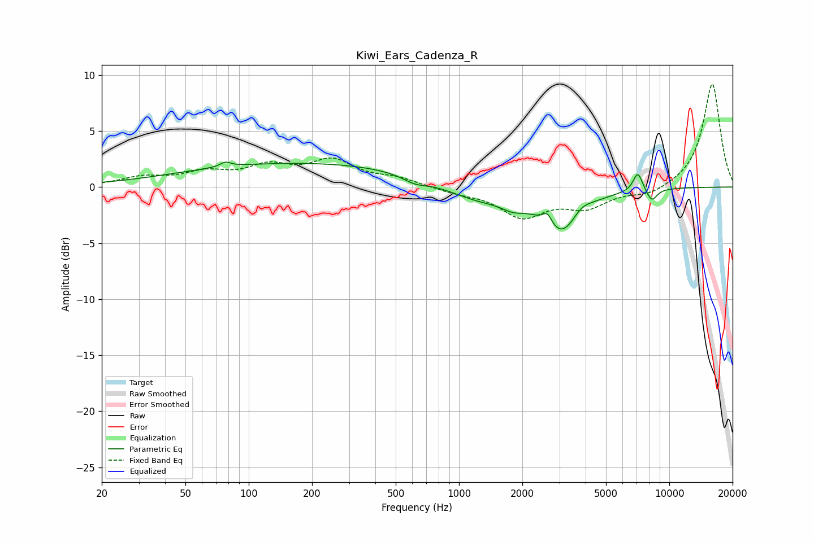

# Kiwi_Ears_Cadenza_R
See [usage instructions](https://github.com/jaakkopasanen/AutoEq#usage) for more options and info.

### Parametric EQs
Apply preamp of -2.3 dB when using parametric equalizer.

|   # | Type    |   Fc (Hz) |    Q |   Gain (dB) |
|-----|---------|-----------|------|-------------|
|   1 | Peaking |        78 | 5.73 |         0.4 |
|   2 | Peaking |       184 | 0.22 |         2.2 |
|   3 | Peaking |       618 | 2.4  |        -0.6 |
|   4 | Peaking |      1231 | 0.87 |        -1.4 |
|   5 | Peaking |      1810 | 2.55 |        -0.7 |
|   6 | Peaking |      2634 | 6    |         1.1 |
|   7 | Peaking |      3095 | 1.49 |        -4.2 |
|   8 | Peaking |      3777 | 2.67 |         1.1 |
|   9 | Peaking |      7089 | 5.97 |         1.7 |
|  10 | Peaking |      8252 | 5.19 |        -1.1 |

### Fixed Band EQs
When using fixed band (also called graphic) equalizer, apply preamp of **-9.3 dB** (if available) and set gains manually with these parameters.

|   # | Type    |   Fc (Hz) |    Q |   Gain (dB) |
|-----|---------|-----------|------|-------------|
|   1 | Peaking |        31 | 1.41 |         0.8 |
|   2 | Peaking |        62 | 1.41 |         1.1 |
|   3 | Peaking |       125 | 1.41 |         1.6 |
|   4 | Peaking |       250 | 1.41 |         2.2 |
|   5 | Peaking |       500 | 1.41 |         0.7 |
|   6 | Peaking |      1000 | 1.41 |        -0.4 |
|   7 | Peaking |      2000 | 1.41 |        -2.5 |
|   8 | Peaking |      4000 | 1.41 |        -1.6 |
|   9 | Peaking |      8000 | 1.41 |        -0.7 |
|  10 | Peaking |     16000 | 1.41 |         9.3 |

### Graphs

