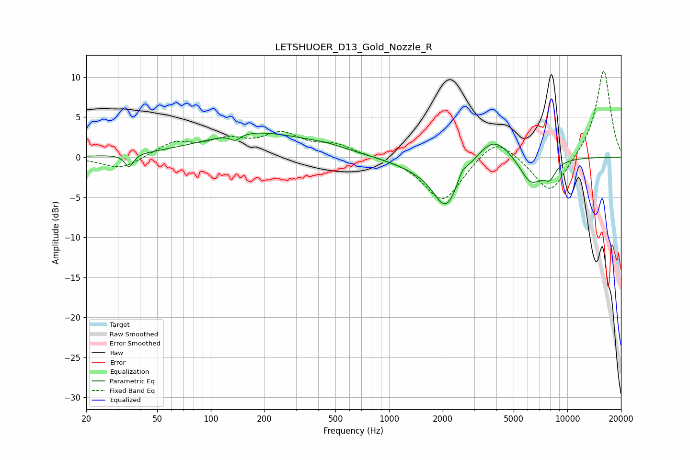

# LETSHUOER_D13_Gold_Nozzle_R
See [usage instructions](https://github.com/jaakkopasanen/AutoEq#usage) for more options and info.

### Parametric EQs
Apply preamp of -3.1 dB when using parametric equalizer.

|   # | Type    |   Fc (Hz) |    Q |   Gain (dB) |
|-----|---------|-----------|------|-------------|
|   1 | Peaking |        35 | 5.99 |        -1.6 |
|   2 | Peaking |       137 | 5.45 |        -0.8 |
|   3 | Peaking |       178 | 0.47 |         3   |
|   4 | Peaking |       452 | 1.25 |         0.5 |
|   5 | Peaking |      1439 | 0.91 |        -1   |
|   6 | Peaking |      2086 | 1.93 |        -5.9 |
|   7 | Peaking |      2572 | 6    |         1   |
|   8 | Peaking |      3875 | 1.43 |         3.1 |
|   9 | Peaking |      6251 | 2.07 |        -3.5 |
|  10 | Peaking |      7967 | 3.88 |        -1.8 |

### Fixed Band EQs
When using fixed band (also called graphic) equalizer, apply preamp of **-10.9 dB** (if available) and set gains manually with these parameters.

|   # | Type    |   Fc (Hz) |    Q |   Gain (dB) |
|-----|---------|-----------|------|-------------|
|   1 | Peaking |        31 | 1.41 |        -1.6 |
|   2 | Peaking |        62 | 1.41 |         1.8 |
|   3 | Peaking |       125 | 1.41 |         1.8 |
|   4 | Peaking |       250 | 1.41 |         2.6 |
|   5 | Peaking |       500 | 1.41 |         1.4 |
|   6 | Peaking |      1000 | 1.41 |        -0   |
|   7 | Peaking |      2000 | 1.41 |        -5.6 |
|   8 | Peaking |      4000 | 1.41 |         2.9 |
|   9 | Peaking |      8000 | 1.41 |        -4.8 |
|  10 | Peaking |     16000 | 1.41 |        11.1 |

### Graphs

