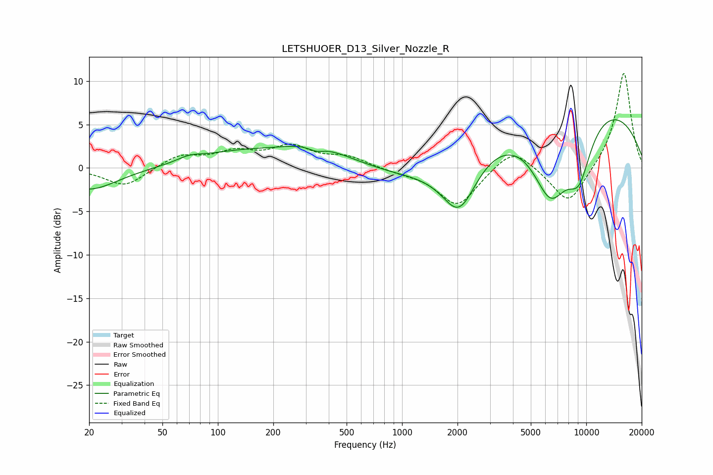

# LETSHUOER_D13_Silver_Nozzle_R
See [usage instructions](https://github.com/jaakkopasanen/AutoEq#usage) for more options and info.

### Parametric EQs
Apply preamp of -5.6 dB when using parametric equalizer.

|   # | Type    |   Fc (Hz) |    Q |   Gain (dB) |
|-----|---------|-----------|------|-------------|
|   1 | Peaking |        20 | 0.93 |        -2.6 |
|   2 | Peaking |        70 | 2.08 |         0.6 |
|   3 | Peaking |       127 | 0.6  |         1.5 |
|   4 | Peaking |       338 | 0.74 |         2.3 |
|   5 | Peaking |       341 | 3.32 |        -0.6 |
|   6 | Peaking |      1396 | 0.49 |        -2.1 |
|   7 | Peaking |      2045 | 1.47 |        -6.5 |
|   8 | Peaking |      6399 | 1.24 |        -9.6 |
|   9 | Peaking |      8170 | 0.22 |         8.6 |
|  10 | Peaking |      9133 | 1.83 |        -6   |

### Fixed Band EQs
When using fixed band (also called graphic) equalizer, apply preamp of **-11.0 dB** (if available) and set gains manually with these parameters.

|   # | Type    |   Fc (Hz) |    Q |   Gain (dB) |
|-----|---------|-----------|------|-------------|
|   1 | Peaking |        31 | 1.41 |        -2.2 |
|   2 | Peaking |        62 | 1.41 |         1.4 |
|   3 | Peaking |       125 | 1.41 |         1.6 |
|   4 | Peaking |       250 | 1.41 |         2.2 |
|   5 | Peaking |       500 | 1.41 |         1.2 |
|   6 | Peaking |      1000 | 1.41 |        -0.4 |
|   7 | Peaking |      2000 | 1.41 |        -4.4 |
|   8 | Peaking |      4000 | 1.41 |         2.6 |
|   9 | Peaking |      8000 | 1.41 |        -4.4 |
|  10 | Peaking |     16000 | 1.41 |        11.2 |

### Graphs

