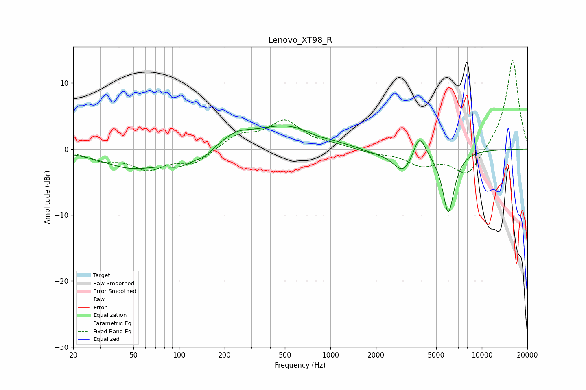

# Lenovo_XT98_R
See [usage instructions](https://github.com/jaakkopasanen/AutoEq#usage) for more options and info.

### Parametric EQs
Apply preamp of -3.6 dB when using parametric equalizer.

|   # | Type    |   Fc (Hz) |    Q |   Gain (dB) |
|-----|---------|-----------|------|-------------|
|   1 | Peaking |        49 | 0.72 |        -2.8 |
|   2 | Peaking |       102 | 1.5  |        -1.8 |
|   3 | Peaking |       146 | 2.82 |        -0.9 |
|   4 | Peaking |       239 | 1.55 |         1.5 |
|   5 | Peaking |       516 | 0.63 |         3.6 |
|   6 | Peaking |       797 | 2.02 |        -0.4 |
|   7 | Peaking |      2118 | 0.94 |        -0.7 |
|   8 | Peaking |      3020 | 2.29 |        -3.1 |
|   9 | Peaking |      3876 | 3.7  |         3.5 |
|  10 | Peaking |      6012 | 3.5  |        -9.5 |

### Fixed Band EQs
When using fixed band (also called graphic) equalizer, apply preamp of **-13.5 dB** (if available) and set gains manually with these parameters.

|   # | Type    |   Fc (Hz) |    Q |   Gain (dB) |
|-----|---------|-----------|------|-------------|
|   1 | Peaking |        31 | 1.41 |        -1.5 |
|   2 | Peaking |        62 | 1.41 |        -2.8 |
|   3 | Peaking |       125 | 1.41 |        -2.1 |
|   4 | Peaking |       250 | 1.41 |         2   |
|   5 | Peaking |       500 | 1.41 |         4.1 |
|   6 | Peaking |      1000 | 1.41 |         0.5 |
|   7 | Peaking |      2000 | 1.41 |        -0.5 |
|   8 | Peaking |      4000 | 1.41 |        -2.2 |
|   9 | Peaking |      8000 | 1.41 |        -4.2 |
|  10 | Peaking |     16000 | 1.41 |        13.8 |

### Graphs

