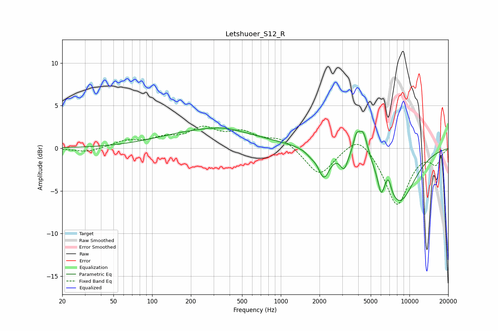

# Letshuoer_S12_R
See [usage instructions](https://github.com/jaakkopasanen/AutoEq#usage) for more options and info.

### Parametric EQs
Apply preamp of -2.5 dB when using parametric equalizer.

|   # | Type    |   Fc (Hz) |    Q |   Gain (dB) |
|-----|---------|-----------|------|-------------|
|   1 | Peaking |       288 | 0.37 |         2.1 |
|   2 | Peaking |       358 | 1.32 |         0.3 |
|   3 | Peaking |      1714 | 3.6  |        -0.5 |
|   4 | Peaking |      2164 | 3.24 |        -3.1 |
|   5 | Peaking |      3103 | 4.95 |        -1.8 |
|   6 | Peaking |      3856 | 6    |         1.7 |
|   7 | Peaking |      4362 | 3.61 |         3.4 |
|   8 | Peaking |      6005 | 6    |        -2.1 |
|   9 | Peaking |      6845 | 6    |         1.7 |
|  10 | Peaking |      8264 | 1.01 |        -6.3 |

### Fixed Band EQs
When using fixed band (also called graphic) equalizer, apply preamp of **-2.7 dB** (if available) and set gains manually with these parameters.

|   # | Type    |   Fc (Hz) |    Q |   Gain (dB) |
|-----|---------|-----------|------|-------------|
|   1 | Peaking |        31 | 1.41 |        -0.5 |
|   2 | Peaking |        62 | 1.41 |         0.8 |
|   3 | Peaking |       125 | 1.41 |         1   |
|   4 | Peaking |       250 | 1.41 |         2.1 |
|   5 | Peaking |       500 | 1.41 |         1.6 |
|   6 | Peaking |      1000 | 1.41 |         1.2 |
|   7 | Peaking |      2000 | 1.41 |        -3.2 |
|   8 | Peaking |      4000 | 1.41 |         2   |
|   9 | Peaking |      8000 | 1.41 |        -6.7 |
|  10 | Peaking |     16000 | 1.41 |        -1.7 |

### Graphs

