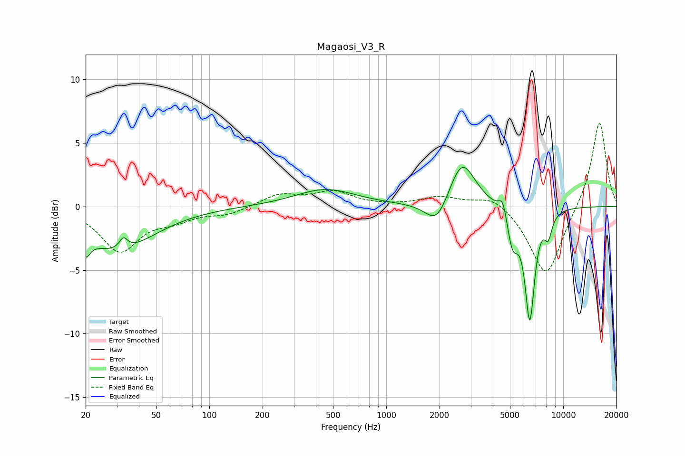

# Magaosi_V3_R
See [usage instructions](https://github.com/jaakkopasanen/AutoEq#usage) for more options and info.

### Parametric EQs
Apply preamp of -3.2 dB when using parametric equalizer.

|   # | Type    |   Fc (Hz) |    Q |   Gain (dB) |
|-----|---------|-----------|------|-------------|
|   1 | Peaking |        20 | 5.76 |        -1.4 |
|   2 | Peaking |        30 | 0.68 |        -3.4 |
|   3 | Peaking |        33 | 6    |         0.9 |
|   4 | Peaking |       454 | 0.83 |         1.4 |
|   5 | Peaking |      1938 | 2.15 |        -2.1 |
|   6 | Peaking |      2675 | 1.89 |         3.8 |
|   7 | Peaking |      4559 | 6    |         1.4 |
|   8 | Peaking |      5171 | 4.37 |        -2.9 |
|   9 | Peaking |      6473 | 4.97 |        -8.6 |
|  10 | Peaking |      8226 | 6    |        -1.7 |

### Fixed Band EQs
When using fixed band (also called graphic) equalizer, apply preamp of **-6.6 dB** (if available) and set gains manually with these parameters.

|   # | Type    |   Fc (Hz) |    Q |   Gain (dB) |
|-----|---------|-----------|------|-------------|
|   1 | Peaking |        31 | 1.41 |        -3.4 |
|   2 | Peaking |        62 | 1.41 |        -0.8 |
|   3 | Peaking |       125 | 1.41 |        -0.6 |
|   4 | Peaking |       250 | 1.41 |         0.9 |
|   5 | Peaking |       500 | 1.41 |         1.1 |
|   6 | Peaking |      1000 | 1.41 |        -0   |
|   7 | Peaking |      2000 | 1.41 |         0.7 |
|   8 | Peaking |      4000 | 1.41 |         1   |
|   9 | Peaking |      8000 | 1.41 |        -5.6 |
|  10 | Peaking |     16000 | 1.41 |         6.8 |

### Graphs

