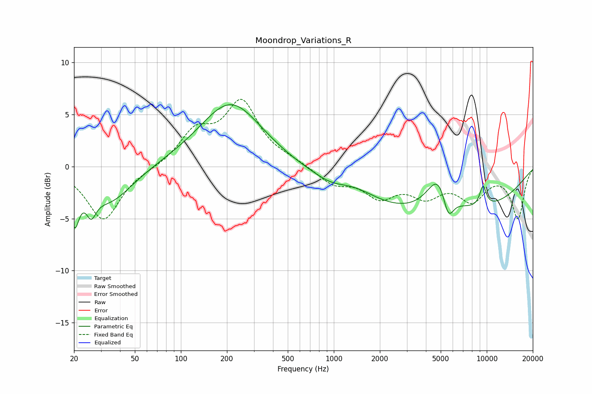

# Moondrop_Variations_R
See [usage instructions](https://github.com/jaakkopasanen/AutoEq#usage) for more options and info.

### Parametric EQs
Apply preamp of -6.0 dB when using parametric equalizer.

|   # | Type    |   Fc (Hz) |    Q |   Gain (dB) |
|-----|---------|-----------|------|-------------|
|   1 | Peaking |        20 | 4.93 |        -4   |
|   2 | Peaking |        26 | 4.54 |        -2   |
|   3 | Peaking |        34 | 0.93 |        -3.4 |
|   4 | Peaking |       212 | 0.7  |         6.2 |
|   5 | Peaking |       951 | 1.5  |        -0.5 |
|   6 | Peaking |      1391 | 1    |         1   |
|   7 | Peaking |      4781 | 0.21 |        -4.8 |
|   8 | Peaking |      4923 | 1.77 |         4.1 |
|   9 | Peaking |      5588 | 3.69 |        -3   |
|  10 | Peaking |      9455 | 5.63 |         2   |

### Fixed Band EQs
When using fixed band (also called graphic) equalizer, apply preamp of **-6.6 dB** (if available) and set gains manually with these parameters.

|   # | Type    |   Fc (Hz) |    Q |   Gain (dB) |
|-----|---------|-----------|------|-------------|
|   1 | Peaking |        31 | 1.41 |        -5.2 |
|   2 | Peaking |        62 | 1.41 |        -0.2 |
|   3 | Peaking |       125 | 1.41 |         3.1 |
|   4 | Peaking |       250 | 1.41 |         5.9 |
|   5 | Peaking |       500 | 1.41 |         0.4 |
|   6 | Peaking |      1000 | 1.41 |        -1.6 |
|   7 | Peaking |      2000 | 1.41 |        -2.6 |
|   8 | Peaking |      4000 | 1.41 |        -2.4 |
|   9 | Peaking |      8000 | 1.41 |        -2.9 |
|  10 | Peaking |     16000 | 1.41 |        -4.9 |

### Graphs

