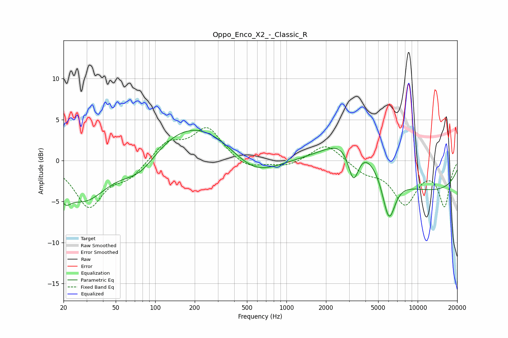

# Oppo_Enco_X2_-_Classic_R
See [usage instructions](https://github.com/jaakkopasanen/AutoEq#usage) for more options and info.

### Parametric EQs
Apply preamp of -3.8 dB when using parametric equalizer.

|   # | Type    |   Fc (Hz) |    Q |   Gain (dB) |
|-----|---------|-----------|------|-------------|
|   1 | Peaking |        21 | 3.43 |        -1.9 |
|   2 | Peaking |        29 | 0.81 |        -4.8 |
|   3 | Peaking |        77 | 1.03 |        -2.8 |
|   4 | Peaking |       200 | 0.41 |         5   |
|   5 | Peaking |       556 | 0.76 |        -3.2 |
|   6 | Peaking |      2797 | 0.53 |         1.3 |
|   7 | Peaking |      3241 | 3.3  |        -4.7 |
|   8 | Peaking |      3319 | 0.77 |         4.5 |
|   9 | Peaking |      6031 | 2.77 |        -5.6 |
|  10 | Peaking |      9645 | 0.19 |        -3.9 |

### Fixed Band EQs
When using fixed band (also called graphic) equalizer, apply preamp of **-4.1 dB** (if available) and set gains manually with these parameters.

|   # | Type    |   Fc (Hz) |    Q |   Gain (dB) |
|-----|---------|-----------|------|-------------|
|   1 | Peaking |        31 | 1.41 |        -5.5 |
|   2 | Peaking |        62 | 1.41 |        -1.8 |
|   3 | Peaking |       125 | 1.41 |         2.2 |
|   4 | Peaking |       250 | 1.41 |         3.9 |
|   5 | Peaking |       500 | 1.41 |        -1.1 |
|   6 | Peaking |      1000 | 1.41 |        -0.8 |
|   7 | Peaking |      2000 | 1.41 |         2.2 |
|   8 | Peaking |      4000 | 1.41 |        -1.3 |
|   9 | Peaking |      8000 | 1.41 |        -5   |
|  10 | Peaking |     16000 | 1.41 |        -5.4 |

### Graphs

