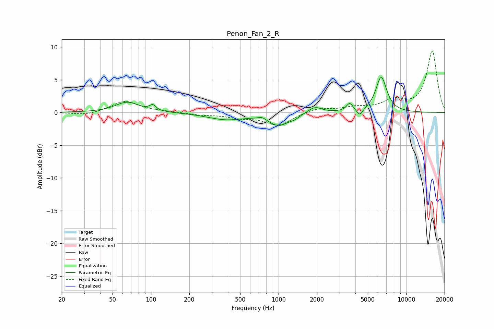

# Penon_Fan_2_R
See [usage instructions](https://github.com/jaakkopasanen/AutoEq#usage) for more options and info.

### Parametric EQs
Apply preamp of -5.5 dB when using parametric equalizer.

|   # | Type    |   Fc (Hz) |    Q |   Gain (dB) |
|-----|---------|-----------|------|-------------|
|   1 | Peaking |        65 | 1.56 |         1.6 |
|   2 | Peaking |       103 | 6    |         0.8 |
|   3 | Peaking |       387 | 0.96 |        -1   |
|   4 | Peaking |       743 | 4.8  |         0.4 |
|   5 | Peaking |      1004 | 1.76 |        -1.9 |
|   6 | Peaking |      1337 | 4.35 |        -0.4 |
|   7 | Peaking |      1925 | 2.67 |         1   |
|   8 | Peaking |      3610 | 5.58 |         1.2 |
|   9 | Peaking |      4331 | 6    |        -1.1 |
|  10 | Peaking |      6375 | 3.18 |         5.4 |

### Fixed Band EQs
When using fixed band (also called graphic) equalizer, apply preamp of **-9.5 dB** (if available) and set gains manually with these parameters.

|   # | Type    |   Fc (Hz) |    Q |   Gain (dB) |
|-----|---------|-----------|------|-------------|
|   1 | Peaking |        31 | 1.41 |        -0.5 |
|   2 | Peaking |        62 | 1.41 |         1.8 |
|   3 | Peaking |       125 | 1.41 |         0.1 |
|   4 | Peaking |       250 | 1.41 |        -0.3 |
|   5 | Peaking |       500 | 1.41 |        -0.7 |
|   6 | Peaking |      1000 | 1.41 |        -1.9 |
|   7 | Peaking |      2000 | 1.41 |         0.7 |
|   8 | Peaking |      4000 | 1.41 |         0.6 |
|   9 | Peaking |      8000 | 1.41 |         1.6 |
|  10 | Peaking |     16000 | 1.41 |         9.4 |

### Graphs

