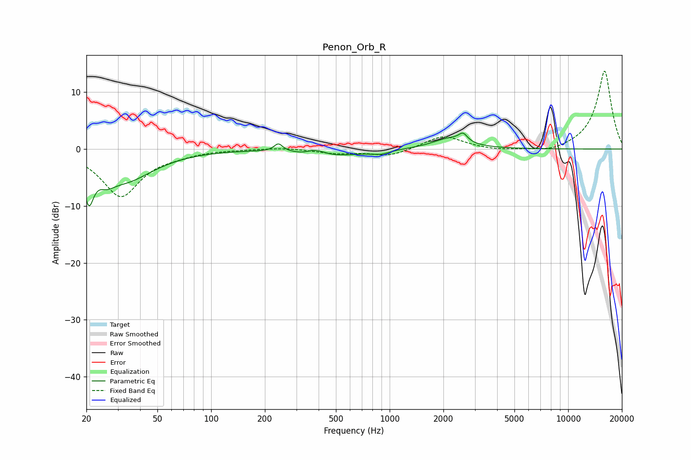

# Penon_Orb_R
See [usage instructions](https://github.com/jaakkopasanen/AutoEq#usage) for more options and info.

### Parametric EQs
Apply preamp of -2.9 dB when using parametric equalizer.

|   # | Type    |   Fc (Hz) |    Q |   Gain (dB) |
|-----|---------|-----------|------|-------------|
|   1 | Peaking |        21 | 5.42 |        -6.3 |
|   2 | Peaking |        26 | 3.42 |        -1.5 |
|   3 | Peaking |        32 | 0.86 |        -5.4 |
|   4 | Peaking |       238 | 6    |         1.4 |
|   5 | Peaking |       358 | 2.21 |        -1.9 |
|   6 | Peaking |       372 | 2.42 |         2.5 |
|   7 | Peaking |       501 | 1.04 |        -1.2 |
|   8 | Peaking |       887 | 2.71 |        -0.7 |
|   9 | Peaking |      2173 | 1.5  |         1.8 |
|  10 | Peaking |      2579 | 5.99 |         1.4 |

### Fixed Band EQs
When using fixed band (also called graphic) equalizer, apply preamp of **-13.8 dB** (if available) and set gains manually with these parameters.

|   # | Type    |   Fc (Hz) |    Q |   Gain (dB) |
|-----|---------|-----------|------|-------------|
|   1 | Peaking |        31 | 1.41 |        -8.3 |
|   2 | Peaking |        62 | 1.41 |        -0.6 |
|   3 | Peaking |       125 | 1.41 |        -0   |
|   4 | Peaking |       250 | 1.41 |         0.3 |
|   5 | Peaking |       500 | 1.41 |        -0.7 |
|   6 | Peaking |      1000 | 1.41 |        -1.3 |
|   7 | Peaking |      2000 | 1.41 |         2.4 |
|   8 | Peaking |      4000 | 1.41 |        -0.4 |
|   9 | Peaking |      8000 | 1.41 |        -0.7 |
|  10 | Peaking |     16000 | 1.41 |        13.8 |

### Graphs

