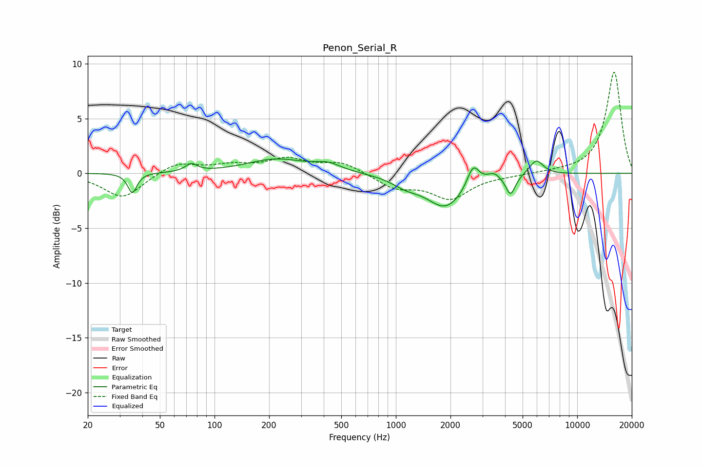

# Penon_Serial_R
See [usage instructions](https://github.com/jaakkopasanen/AutoEq#usage) for more options and info.

### Parametric EQs
Apply preamp of -1.4 dB when using parametric equalizer.

|   # | Type    |   Fc (Hz) |    Q |   Gain (dB) |
|-----|---------|-----------|------|-------------|
|   1 | Peaking |        35 | 5.94 |        -1.8 |
|   2 | Peaking |        75 | 4.55 |         0.7 |
|   3 | Peaking |       219 | 0.87 |         1.3 |
|   4 | Peaking |       422 | 1.96 |         0.6 |
|   5 | Peaking |      1137 | 1.86 |        -0.7 |
|   6 | Peaking |      1884 | 1.35 |        -3   |
|   7 | Peaking |      2666 | 4.27 |         2   |
|   8 | Peaking |      3470 | 4.21 |         0.6 |
|   9 | Peaking |      4291 | 5.3  |        -1.8 |
|  10 | Peaking |      5948 | 3.62 |         1.4 |

### Fixed Band EQs
When using fixed band (also called graphic) equalizer, apply preamp of **-9.3 dB** (if available) and set gains manually with these parameters.

|   # | Type    |   Fc (Hz) |    Q |   Gain (dB) |
|-----|---------|-----------|------|-------------|
|   1 | Peaking |        31 | 1.41 |        -2.3 |
|   2 | Peaking |        62 | 1.41 |         1   |
|   3 | Peaking |       125 | 1.41 |         0.6 |
|   4 | Peaking |       250 | 1.41 |         1.2 |
|   5 | Peaking |       500 | 1.41 |         1   |
|   6 | Peaking |      1000 | 1.41 |        -1.3 |
|   7 | Peaking |      2000 | 1.41 |        -2.2 |
|   8 | Peaking |      4000 | 1.41 |        -0.2 |
|   9 | Peaking |      8000 | 1.41 |         0.1 |
|  10 | Peaking |     16000 | 1.41 |         9.3 |

### Graphs

