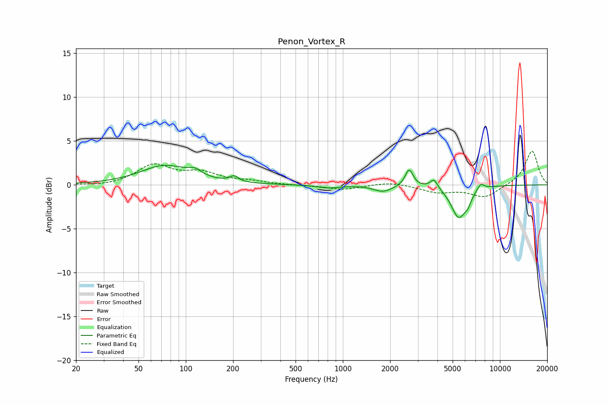

# Penon_Vortex_R
See [usage instructions](https://github.com/jaakkopasanen/AutoEq#usage) for more options and info.

### Parametric EQs
Apply preamp of -2.3 dB when using parametric equalizer.

|   # | Type    |   Fc (Hz) |    Q |   Gain (dB) |
|-----|---------|-----------|------|-------------|
|   1 | Peaking |        74 | 0.92 |         2.2 |
|   2 | Peaking |       114 | 3.41 |         0.7 |
|   3 | Peaking |       203 | 5.25 |         0.6 |
|   4 | Peaking |       804 | 2.02 |        -0.3 |
|   5 | Peaking |      1801 | 2.43 |        -0.8 |
|   6 | Peaking |      2643 | 5.69 |         2   |
|   7 | Peaking |      3802 | 6    |         1.1 |
|   8 | Peaking |      5459 | 2.89 |        -3.6 |
|   9 | Peaking |      6262 | 6    |        -0.9 |
|  10 | Peaking |      7539 | 5.99 |         0.7 |

### Fixed Band EQs
When using fixed band (also called graphic) equalizer, apply preamp of **-3.9 dB** (if available) and set gains manually with these parameters.

|   # | Type    |   Fc (Hz) |    Q |   Gain (dB) |
|-----|---------|-----------|------|-------------|
|   1 | Peaking |        31 | 1.41 |        -0.2 |
|   2 | Peaking |        62 | 1.41 |         2.2 |
|   3 | Peaking |       125 | 1.41 |         1.2 |
|   4 | Peaking |       250 | 1.41 |         0.4 |
|   5 | Peaking |       500 | 1.41 |        -0   |
|   6 | Peaking |      1000 | 1.41 |        -0.5 |
|   7 | Peaking |      2000 | 1.41 |         0.4 |
|   8 | Peaking |      4000 | 1.41 |        -0.8 |
|   9 | Peaking |      8000 | 1.41 |        -1.4 |
|  10 | Peaking |     16000 | 1.41 |         3.9 |

### Graphs

