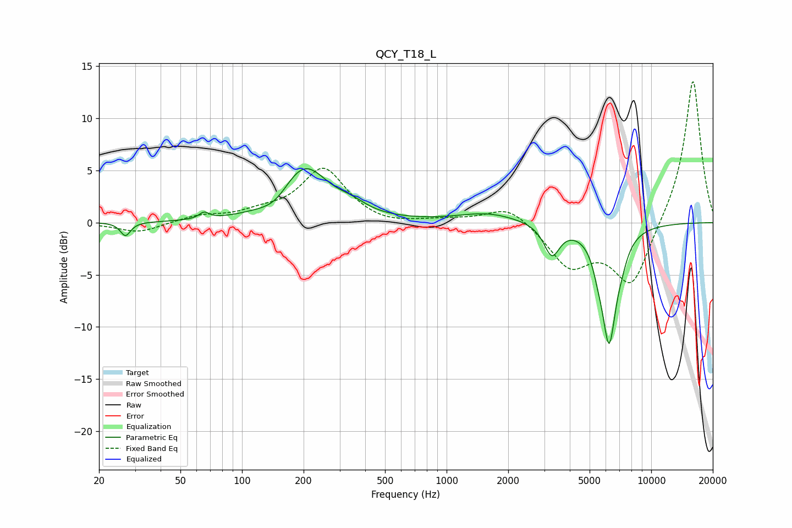

# QCY_T18_L
See [usage instructions](https://github.com/jaakkopasanen/AutoEq#usage) for more options and info.

### Parametric EQs
Apply preamp of -5.3 dB when using parametric equalizer.

|   # | Type    |   Fc (Hz) |    Q |   Gain (dB) |
|-----|---------|-----------|------|-------------|
|   1 | Peaking |        27 | 5.96 |        -1.3 |
|   2 | Peaking |        65 | 6    |         0.6 |
|   3 | Peaking |       146 | 1.89 |        -1.2 |
|   4 | Peaking |       201 | 1.21 |         5.5 |
|   5 | Peaking |       343 | 1.97 |         0.7 |
|   6 | Peaking |      1587 | 0.98 |         0.9 |
|   7 | Peaking |      3267 | 3.67 |        -3   |
|   8 | Peaking |      5486 | 5.99 |        -1   |
|   9 | Peaking |      6223 | 3.64 |       -11.1 |
|  10 | Peaking |      7186 | 4.79 |        -0.8 |

### Fixed Band EQs
When using fixed band (also called graphic) equalizer, apply preamp of **-13.6 dB** (if available) and set gains manually with these parameters.

|   # | Type    |   Fc (Hz) |    Q |   Gain (dB) |
|-----|---------|-----------|------|-------------|
|   1 | Peaking |        31 | 1.41 |        -1   |
|   2 | Peaking |        62 | 1.41 |         0.6 |
|   3 | Peaking |       125 | 1.41 |         0.7 |
|   4 | Peaking |       250 | 1.41 |         5.1 |
|   5 | Peaking |       500 | 1.41 |        -0.4 |
|   6 | Peaking |      1000 | 1.41 |         0.2 |
|   7 | Peaking |      2000 | 1.41 |         1.7 |
|   8 | Peaking |      4000 | 1.41 |        -4   |
|   9 | Peaking |      8000 | 1.41 |        -6.1 |
|  10 | Peaking |     16000 | 1.41 |        14   |

### Graphs

