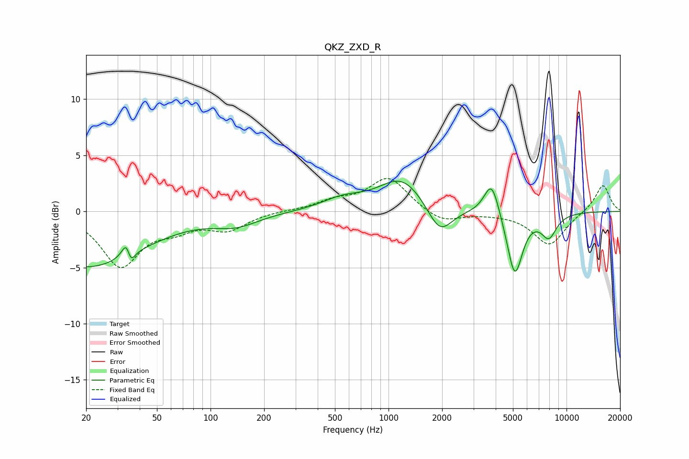

# QKZ_ZXD_R
See [usage instructions](https://github.com/jaakkopasanen/AutoEq#usage) for more options and info.

### Parametric EQs
Apply preamp of -2.8 dB when using parametric equalizer.

|   # | Type    |   Fc (Hz) |    Q |   Gain (dB) |
|-----|---------|-----------|------|-------------|
|   1 | Peaking |        20 | 0.44 |        -4.9 |
|   2 | Peaking |        34 | 5.67 |         3.4 |
|   3 | Peaking |        35 | 6    |        -3.1 |
|   4 | Peaking |       140 | 1.12 |        -1   |
|   5 | Peaking |       555 | 1.18 |         1   |
|   6 | Peaking |      1191 | 1.1  |         3   |
|   7 | Peaking |      1940 | 2.01 |        -2.7 |
|   8 | Peaking |      3796 | 3.33 |         3.1 |
|   9 | Peaking |      5121 | 3.19 |        -5.7 |
|  10 | Peaking |      7958 | 3.02 |        -2   |

### Fixed Band EQs
When using fixed band (also called graphic) equalizer, apply preamp of **-3.0 dB** (if available) and set gains manually with these parameters.

|   # | Type    |   Fc (Hz) |    Q |   Gain (dB) |
|-----|---------|-----------|------|-------------|
|   1 | Peaking |        31 | 1.41 |        -4.7 |
|   2 | Peaking |        62 | 1.41 |        -1.2 |
|   3 | Peaking |       125 | 1.41 |        -1.5 |
|   4 | Peaking |       250 | 1.41 |         0.1 |
|   5 | Peaking |       500 | 1.41 |         0.8 |
|   6 | Peaking |      1000 | 1.41 |         3   |
|   7 | Peaking |      2000 | 1.41 |        -1.1 |
|   8 | Peaking |      4000 | 1.41 |        -0.1 |
|   9 | Peaking |      8000 | 1.41 |        -3   |
|  10 | Peaking |     16000 | 1.41 |         2.4 |

### Graphs

