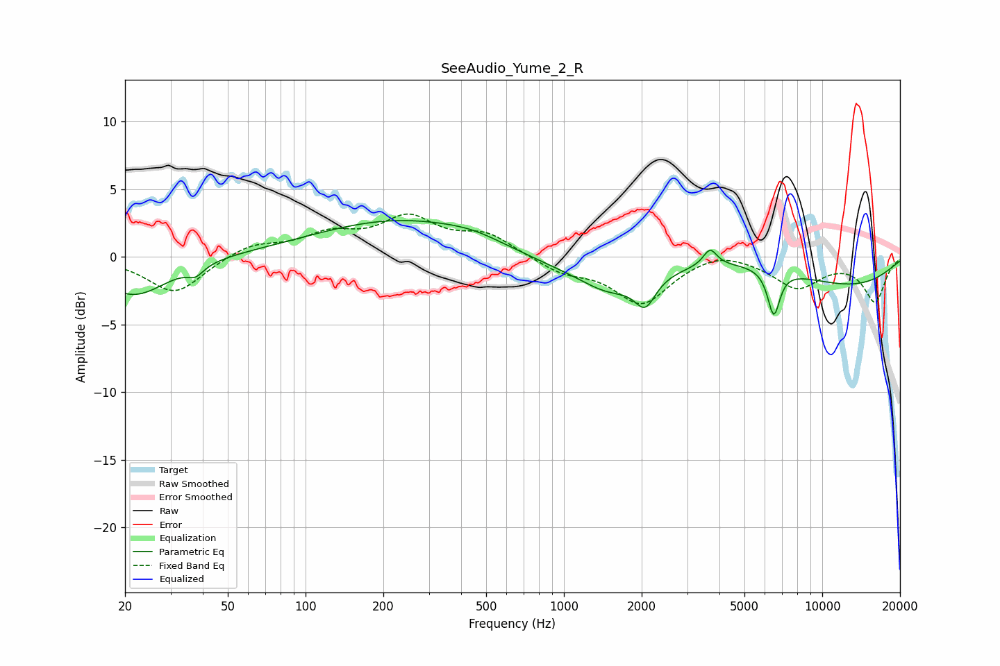

# SeeAudio_Yume_2_R
See [usage instructions](https://github.com/jaakkopasanen/AutoEq#usage) for more options and info.

### Parametric EQs
Apply preamp of -2.8 dB when using parametric equalizer.

|   # | Type    |   Fc (Hz) |    Q |   Gain (dB) |
|-----|---------|-----------|------|-------------|
|   1 | Peaking |        22 | 1.08 |        -2.9 |
|   2 | Peaking |        38 | 4.51 |        -0.7 |
|   3 | Peaking |       237 | 0.42 |         2.8 |
|   4 | Peaking |       447 | 1.23 |         0.5 |
|   5 | Peaking |      1495 | 1.32 |        -1.4 |
|   6 | Peaking |      2065 | 3.55 |        -2.1 |
|   7 | Peaking |      3681 | 5.32 |         1.3 |
|   8 | Peaking |      4360 | 0.38 |         3.7 |
|   9 | Peaking |      5127 | 0.18 |        -4.2 |
|  10 | Peaking |      6493 | 5.79 |        -3.4 |

### Fixed Band EQs
When using fixed band (also called graphic) equalizer, apply preamp of **-3.3 dB** (if available) and set gains manually with these parameters.

|   # | Type    |   Fc (Hz) |    Q |   Gain (dB) |
|-----|---------|-----------|------|-------------|
|   1 | Peaking |        31 | 1.41 |        -2.7 |
|   2 | Peaking |        62 | 1.41 |         0.9 |
|   3 | Peaking |       125 | 1.41 |         1.5 |
|   4 | Peaking |       250 | 1.41 |         2.7 |
|   5 | Peaking |       500 | 1.41 |         1.6 |
|   6 | Peaking |      1000 | 1.41 |        -1   |
|   7 | Peaking |      2000 | 1.41 |        -3.4 |
|   8 | Peaking |      4000 | 1.41 |         0.7 |
|   9 | Peaking |      8000 | 1.41 |        -2.2 |
|  10 | Peaking |     16000 | 1.41 |        -3.3 |

### Graphs

