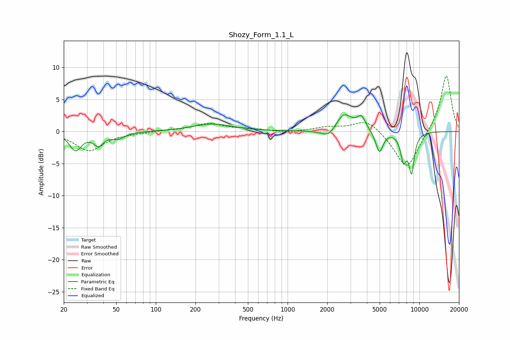

# Shozy_Form_1.1_L
See [usage instructions](https://github.com/jaakkopasanen/AutoEq#usage) for more options and info.

### Parametric EQs
Apply preamp of -2.7 dB when using parametric equalizer.

|   # | Type    |   Fc (Hz) |    Q |   Gain (dB) |
|-----|---------|-----------|------|-------------|
|   1 | Peaking |        25 | 3.11 |        -2.8 |
|   2 | Peaking |        37 | 3.75 |        -1.8 |
|   3 | Peaking |        51 | 2.72 |        -1   |
|   4 | Peaking |       268 | 0.94 |         1.2 |
|   5 | Peaking |      2071 | 2.46 |        -1.6 |
|   6 | Peaking |      2662 | 2.17 |         3   |
|   7 | Peaking |      3637 | 4.44 |         1.9 |
|   8 | Peaking |      4977 | 4.99 |        -3.3 |
|   9 | Peaking |      7577 | 5.86 |        -4   |
|  10 | Peaking |      8727 | 6    |        -5.9 |

### Fixed Band EQs
When using fixed band (also called graphic) equalizer, apply preamp of **-8.8 dB** (if available) and set gains manually with these parameters.

|   # | Type    |   Fc (Hz) |    Q |   Gain (dB) |
|-----|---------|-----------|------|-------------|
|   1 | Peaking |        31 | 1.41 |        -3   |
|   2 | Peaking |        62 | 1.41 |        -0.2 |
|   3 | Peaking |       125 | 1.41 |         0.1 |
|   4 | Peaking |       250 | 1.41 |         1.2 |
|   5 | Peaking |       500 | 1.41 |         0.3 |
|   6 | Peaking |      1000 | 1.41 |        -0.2 |
|   7 | Peaking |      2000 | 1.41 |         0.6 |
|   8 | Peaking |      4000 | 1.41 |         2   |
|   9 | Peaking |      8000 | 1.41 |        -6   |
|  10 | Peaking |     16000 | 1.41 |         9   |

### Graphs

