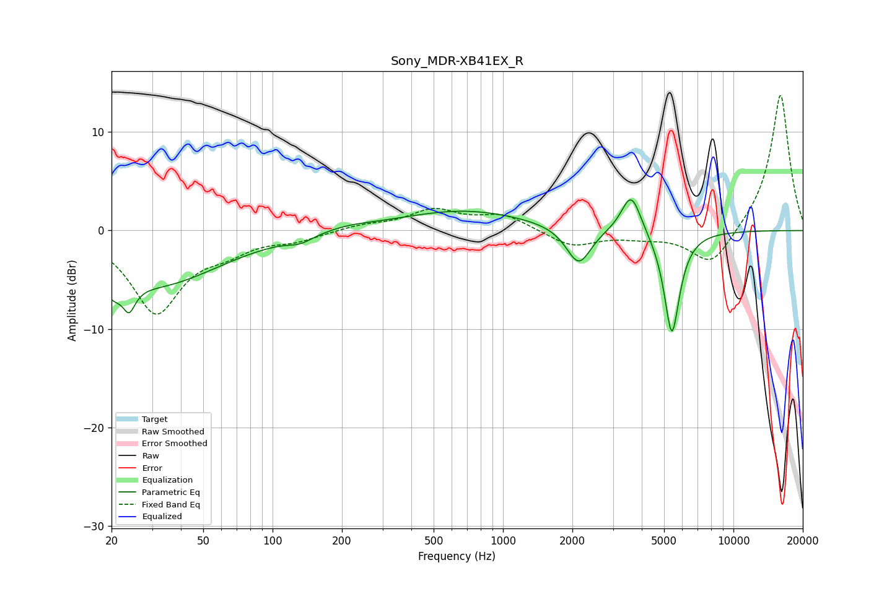

# Sony_MDR-XB41EX_R
See [usage instructions](https://github.com/jaakkopasanen/AutoEq#usage) for more options and info.

### Parametric EQs
Apply preamp of -3.2 dB when using parametric equalizer.

|   # | Type    |   Fc (Hz) |    Q |   Gain (dB) |
|-----|---------|-----------|------|-------------|
|   1 | Peaking |        20 | 3.36 |        -2   |
|   2 | Peaking |        24 | 5.91 |         3.3 |
|   3 | Peaking |        24 | 5.57 |        -5.8 |
|   4 | Peaking |        31 | 0.51 |        -5.4 |
|   5 | Peaking |       132 | 2.59 |        -0.7 |
|   6 | Peaking |       212 | 1.27 |         0.4 |
|   7 | Peaking |       678 | 0.51 |         2   |
|   8 | Peaking |      2131 | 2.65 |        -3.9 |
|   9 | Peaking |      3600 | 3.29 |         4.1 |
|  10 | Peaking |      5405 | 4.07 |       -10.7 |

### Fixed Band EQs
When using fixed band (also called graphic) equalizer, apply preamp of **-13.8 dB** (if available) and set gains manually with these parameters.

|   # | Type    |   Fc (Hz) |    Q |   Gain (dB) |
|-----|---------|-----------|------|-------------|
|   1 | Peaking |        31 | 1.41 |        -8.2 |
|   2 | Peaking |        62 | 1.41 |        -1.5 |
|   3 | Peaking |       125 | 1.41 |        -0.8 |
|   4 | Peaking |       250 | 1.41 |         0.5 |
|   5 | Peaking |       500 | 1.41 |         2   |
|   6 | Peaking |      1000 | 1.41 |         1.5 |
|   7 | Peaking |      2000 | 1.41 |        -1.6 |
|   8 | Peaking |      4000 | 1.41 |        -0.5 |
|   9 | Peaking |      8000 | 1.41 |        -3.8 |
|  10 | Peaking |     16000 | 1.41 |        14   |

### Graphs

