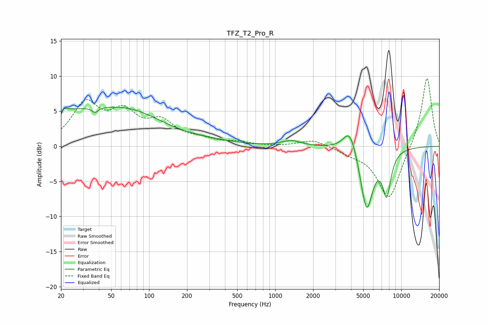

# TFZ_T2_Pro_R
See [usage instructions](https://github.com/jaakkopasanen/AutoEq#usage) for more options and info.

### Parametric EQs
Apply preamp of -5.7 dB when using parametric equalizer.

|   # | Type    |   Fc (Hz) |    Q |   Gain (dB) |
|-----|---------|-----------|------|-------------|
|   1 | Peaking |        20 | 5.9  |        -3   |
|   2 | Peaking |        20 | 5.88 |         2.5 |
|   3 | Peaking |        25 | 0.2  |         5   |
|   4 | Peaking |        37 | 6    |        -0.7 |
|   5 | Peaking |        76 | 0.64 |         1.3 |
|   6 | Peaking |       305 | 0.88 |         0.4 |
|   7 | Peaking |      1345 | 1.88 |         0.8 |
|   8 | Peaking |      3919 | 2.64 |         3.6 |
|   9 | Peaking |      5314 | 2.74 |        -9.1 |
|  10 | Peaking |      7672 | 4    |        -6   |

### Fixed Band EQs
When using fixed band (also called graphic) equalizer, apply preamp of **-9.8 dB** (if available) and set gains manually with these parameters.

|   # | Type    |   Fc (Hz) |    Q |   Gain (dB) |
|-----|---------|-----------|------|-------------|
|   1 | Peaking |        31 | 1.41 |         5.7 |
|   2 | Peaking |        62 | 1.41 |         4.1 |
|   3 | Peaking |       125 | 1.41 |         3   |
|   4 | Peaking |       250 | 1.41 |         0.8 |
|   5 | Peaking |       500 | 1.41 |         0.5 |
|   6 | Peaking |      1000 | 1.41 |        -0   |
|   7 | Peaking |      2000 | 1.41 |         1   |
|   8 | Peaking |      4000 | 1.41 |        -0.7 |
|   9 | Peaking |      8000 | 1.41 |        -7.7 |
|  10 | Peaking |     16000 | 1.41 |        10.1 |

### Graphs

