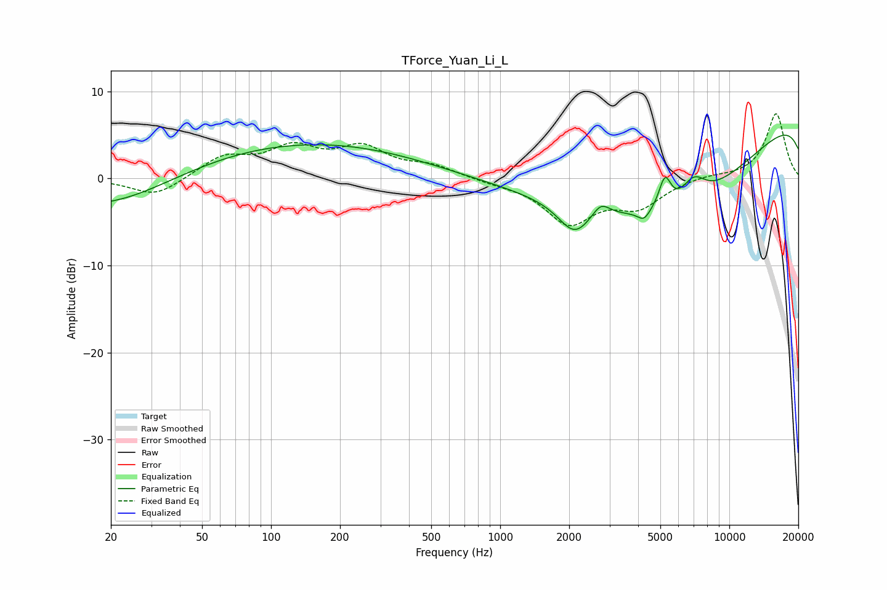

# TForce_Yuan_Li_L
See [usage instructions](https://github.com/jaakkopasanen/AutoEq#usage) for more options and info.

### Parametric EQs
Apply preamp of -5.1 dB when using parametric equalizer.

|   # | Type    |   Fc (Hz) |    Q |   Gain (dB) |
|-----|---------|-----------|------|-------------|
|   1 | Peaking |        20 | 0.44 |        -5.9 |
|   2 | Peaking |        74 | 0.18 |         4.6 |
|   3 | Peaking |       750 | 0.25 |         0.7 |
|   4 | Peaking |      2109 | 2.01 |        -3.5 |
|   5 | Peaking |      2750 | 3.74 |         1.6 |
|   6 | Peaking |      4238 | 5.25 |        -1.1 |
|   7 | Peaking |      5234 | 5.2  |         3.6 |
|   8 | Peaking |      5813 | 0.28 |       -15.3 |
|   9 | Peaking |      6986 | 2.47 |         2.9 |
|  10 | Peaking |     10000 | 0.18 |        12.4 |

### Fixed Band EQs
When using fixed band (also called graphic) equalizer, apply preamp of **-7.5 dB** (if available) and set gains manually with these parameters.

|   # | Type    |   Fc (Hz) |    Q |   Gain (dB) |
|-----|---------|-----------|------|-------------|
|   1 | Peaking |        31 | 1.41 |        -2.1 |
|   2 | Peaking |        62 | 1.41 |         2.4 |
|   3 | Peaking |       125 | 1.41 |         3.2 |
|   4 | Peaking |       250 | 1.41 |         3.2 |
|   5 | Peaking |       500 | 1.41 |         1.3 |
|   6 | Peaking |      1000 | 1.41 |        -0.4 |
|   7 | Peaking |      2000 | 1.41 |        -4.9 |
|   8 | Peaking |      4000 | 1.41 |        -3   |
|   9 | Peaking |      8000 | 1.41 |         0.4 |
|  10 | Peaking |     16000 | 1.41 |         7.5 |

### Graphs

