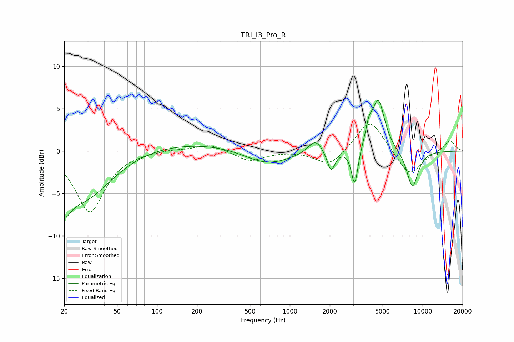

# TRI_I3_Pro_R
See [usage instructions](https://github.com/jaakkopasanen/AutoEq#usage) for more options and info.

### Parametric EQs
Apply preamp of -6.1 dB when using parametric equalizer.

|   # | Type    |   Fc (Hz) |    Q |   Gain (dB) |
|-----|---------|-----------|------|-------------|
|   1 | Peaking |        20 | 3.08 |        -3   |
|   2 | Peaking |        27 | 0.65 |        -5.8 |
|   3 | Peaking |       178 | 0.26 |         1.1 |
|   4 | Peaking |       670 | 0.78 |        -1.9 |
|   5 | Peaking |      1560 | 2.65 |         1.7 |
|   6 | Peaking |      2045 | 4.84 |        -2.5 |
|   7 | Peaking |      3080 | 5.73 |        -4.5 |
|   8 | Peaking |      3941 | 5.68 |         1.8 |
|   9 | Peaking |      4638 | 2.89 |         6   |
|  10 | Peaking |      8380 | 2.96 |        -4.4 |

### Fixed Band EQs
When using fixed band (also called graphic) equalizer, apply preamp of **-3.3 dB** (if available) and set gains manually with these parameters.

|   # | Type    |   Fc (Hz) |    Q |   Gain (dB) |
|-----|---------|-----------|------|-------------|
|   1 | Peaking |        31 | 1.41 |        -7.2 |
|   2 | Peaking |        62 | 1.41 |        -0   |
|   3 | Peaking |       125 | 1.41 |         0.2 |
|   4 | Peaking |       250 | 1.41 |         0.9 |
|   5 | Peaking |       500 | 1.41 |        -1.2 |
|   6 | Peaking |      1000 | 1.41 |         0.1 |
|   7 | Peaking |      2000 | 1.41 |        -1.9 |
|   8 | Peaking |      4000 | 1.41 |         3.9 |
|   9 | Peaking |      8000 | 1.41 |        -3   |
|  10 | Peaking |     16000 | 1.41 |         1.3 |

### Graphs

