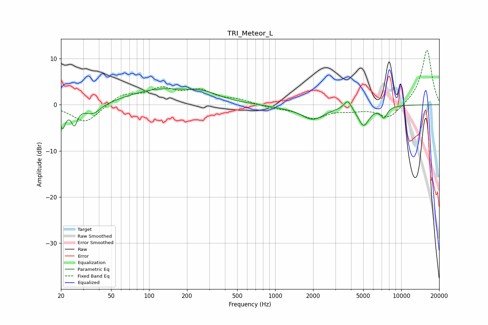

# TRI_Meteor_L
See [usage instructions](https://github.com/jaakkopasanen/AutoEq#usage) for more options and info.

### Parametric EQs
Apply preamp of -3.6 dB when using parametric equalizer.

|   # | Type    |   Fc (Hz) |    Q |   Gain (dB) |
|-----|---------|-----------|------|-------------|
|   1 | Peaking |        21 | 5.86 |        -4.7 |
|   2 | Peaking |        26 | 5.89 |        -3.7 |
|   3 | Peaking |        36 | 2.18 |        -2.3 |
|   4 | Peaking |       121 | 0.58 |         3.2 |
|   5 | Peaking |       271 | 1.14 |         1.6 |
|   6 | Peaking |      1115 | 1.23 |        -0.4 |
|   7 | Peaking |      1992 | 1.53 |        -3   |
|   8 | Peaking |      3766 | 4.76 |         2.1 |
|   9 | Peaking |      5032 | 3.14 |        -4.3 |
|  10 | Peaking |      7300 | 5.13 |        -2.3 |

### Fixed Band EQs
When using fixed band (also called graphic) equalizer, apply preamp of **-11.9 dB** (if available) and set gains manually with these parameters.

|   # | Type    |   Fc (Hz) |    Q |   Gain (dB) |
|-----|---------|-----------|------|-------------|
|   1 | Peaking |        31 | 1.41 |        -4   |
|   2 | Peaking |        62 | 1.41 |         2.2 |
|   3 | Peaking |       125 | 1.41 |         3.1 |
|   4 | Peaking |       250 | 1.41 |         2.7 |
|   5 | Peaking |       500 | 1.41 |         0.9 |
|   6 | Peaking |      1000 | 1.41 |        -0.6 |
|   7 | Peaking |      2000 | 1.41 |        -2.8 |
|   8 | Peaking |      4000 | 1.41 |        -0.9 |
|   9 | Peaking |      8000 | 1.41 |        -3.1 |
|  10 | Peaking |     16000 | 1.41 |        12.1 |

### Graphs

