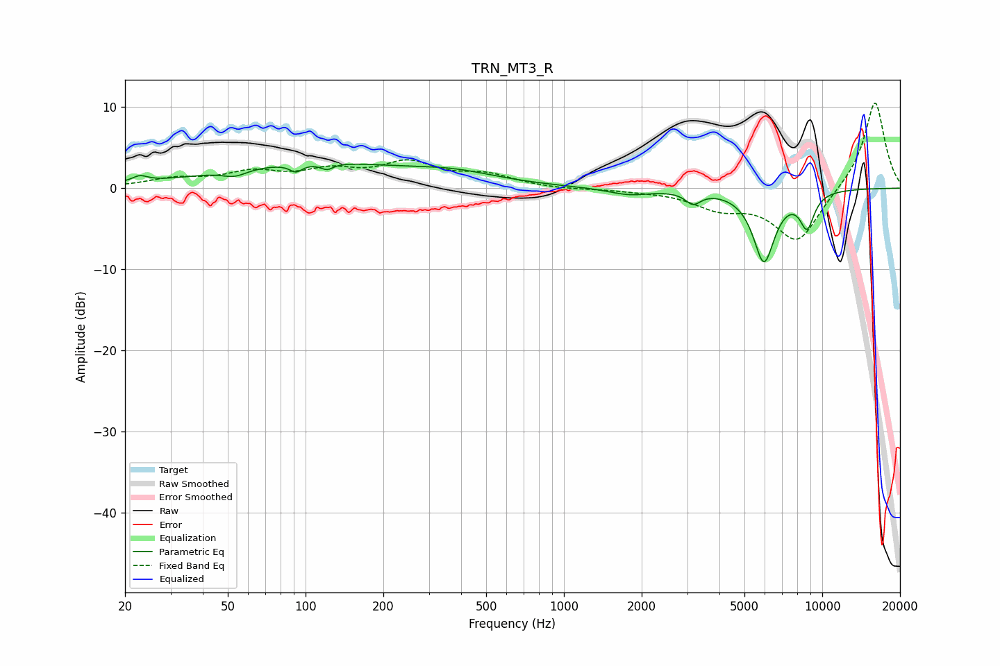

# TRN_MT3_R
See [usage instructions](https://github.com/jaakkopasanen/AutoEq#usage) for more options and info.

### Parametric EQs
Apply preamp of -3.1 dB when using parametric equalizer.

|   # | Type    |   Fc (Hz) |    Q |   Gain (dB) |
|-----|---------|-----------|------|-------------|
|   1 | Peaking |        23 | 4.71 |         0.8 |
|   2 | Peaking |        53 | 2.99 |        -0.8 |
|   3 | Peaking |        92 | 6    |        -1   |
|   4 | Peaking |       104 | 0.38 |         3   |
|   5 | Peaking |       121 | 5.95 |        -0.8 |
|   6 | Peaking |       377 | 0.81 |         1.3 |
|   7 | Peaking |      1788 | 1.73 |        -0.8 |
|   8 | Peaking |      3162 | 4.77 |        -1.5 |
|   9 | Peaking |      5950 | 3.23 |        -8.8 |
|  10 | Peaking |      8737 | 4.59 |        -4.2 |

### Fixed Band EQs
When using fixed band (also called graphic) equalizer, apply preamp of **-10.6 dB** (if available) and set gains manually with these parameters.

|   # | Type    |   Fc (Hz) |    Q |   Gain (dB) |
|-----|---------|-----------|------|-------------|
|   1 | Peaking |        31 | 1.41 |         1   |
|   2 | Peaking |        62 | 1.41 |         1.7 |
|   3 | Peaking |       125 | 1.41 |         1.8 |
|   4 | Peaking |       250 | 1.41 |         2.8 |
|   5 | Peaking |       500 | 1.41 |         1.4 |
|   6 | Peaking |      1000 | 1.41 |        -0.2 |
|   7 | Peaking |      2000 | 1.41 |        -0.2 |
|   8 | Peaking |      4000 | 1.41 |        -2.1 |
|   9 | Peaking |      8000 | 1.41 |        -6.6 |
|  10 | Peaking |     16000 | 1.41 |        10.9 |

### Graphs

