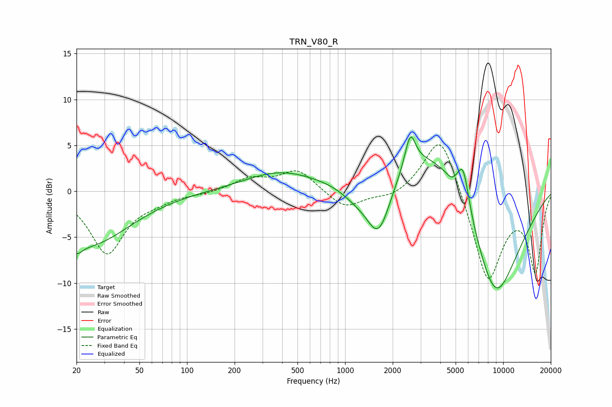

# TRN_V80_R
See [usage instructions](https://github.com/jaakkopasanen/AutoEq#usage) for more options and info.

### Parametric EQs
Apply preamp of -6.0 dB when using parametric equalizer.

|   # | Type    |   Fc (Hz) |    Q |   Gain (dB) |
|-----|---------|-----------|------|-------------|
|   1 | Peaking |        20 | 4.11 |        -1.2 |
|   2 | Peaking |        24 | 0.54 |        -5.8 |
|   3 | Peaking |       385 | 0.63 |         2   |
|   4 | Peaking |      1160 | 1.4  |        -1.4 |
|   5 | Peaking |      1631 | 1.72 |        -6.8 |
|   6 | Peaking |      2583 | 4.35 |         3.6 |
|   7 | Peaking |      3583 | 0.49 |         6.9 |
|   8 | Peaking |      4699 | 6    |        -0.3 |
|   9 | Peaking |      5585 | 3.69 |         4.4 |
|  10 | Peaking |      8837 | 0.75 |       -13.5 |

### Fixed Band EQs
When using fixed band (also called graphic) equalizer, apply preamp of **-5.2 dB** (if available) and set gains manually with these parameters.

|   # | Type    |   Fc (Hz) |    Q |   Gain (dB) |
|-----|---------|-----------|------|-------------|
|   1 | Peaking |        31 | 1.41 |        -6.7 |
|   2 | Peaking |        62 | 1.41 |        -0.7 |
|   3 | Peaking |       125 | 1.41 |        -0.2 |
|   4 | Peaking |       250 | 1.41 |         1.3 |
|   5 | Peaking |       500 | 1.41 |         2.3 |
|   6 | Peaking |      1000 | 1.41 |        -1.9 |
|   7 | Peaking |      2000 | 1.41 |        -0.8 |
|   8 | Peaking |      4000 | 1.41 |         6.9 |
|   9 | Peaking |      8000 | 1.41 |       -10   |
|  10 | Peaking |     16000 | 1.41 |        -8.5 |

### Graphs

