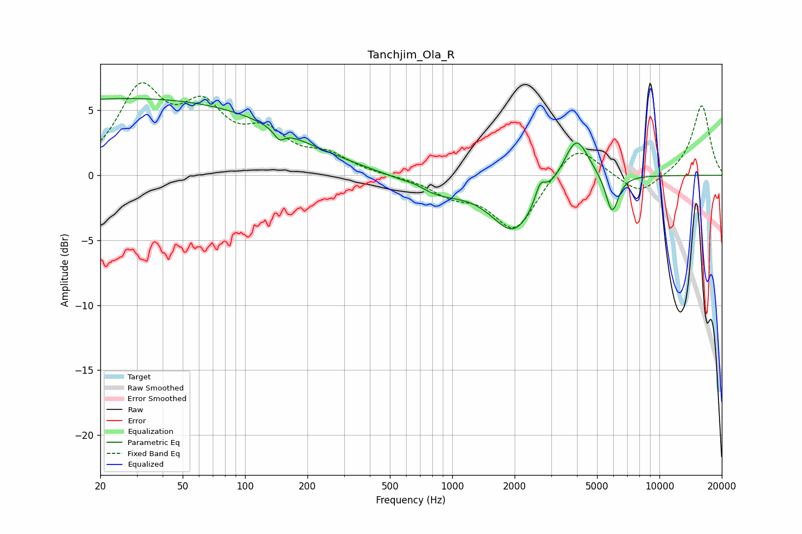

# Tanchjim_Ola_R
See [usage instructions](https://github.com/jaakkopasanen/AutoEq#usage) for more options and info.

### Parametric EQs
Apply preamp of -6.0 dB when using parametric equalizer.

|   # | Type    |   Fc (Hz) |    Q |   Gain (dB) |
|-----|---------|-----------|------|-------------|
|   1 | Peaking |        20 | 0.2  |         5.7 |
|   2 | Peaking |       125 | 0.46 |         1.7 |
|   3 | Peaking |       147 | 5.88 |        -4   |
|   4 | Peaking |       147 | 5.97 |         3.2 |
|   5 | Peaking |       665 | 2.7  |         0.3 |
|   6 | Peaking |       837 | 1.01 |        -1.3 |
|   7 | Peaking |      1986 | 1.29 |        -4.2 |
|   8 | Peaking |      2658 | 5.71 |         1.4 |
|   9 | Peaking |      3965 | 2.35 |         3.5 |
|  10 | Peaking |      5911 | 4.49 |        -3   |

### Fixed Band EQs
When using fixed band (also called graphic) equalizer, apply preamp of **-7.2 dB** (if available) and set gains manually with these parameters.

|   # | Type    |   Fc (Hz) |    Q |   Gain (dB) |
|-----|---------|-----------|------|-------------|
|   1 | Peaking |        31 | 1.41 |         6.2 |
|   2 | Peaking |        62 | 1.41 |         4.3 |
|   3 | Peaking |       125 | 1.41 |         2.7 |
|   4 | Peaking |       250 | 1.41 |         1.3 |
|   5 | Peaking |       500 | 1.41 |        -0   |
|   6 | Peaking |      1000 | 1.41 |        -1.3 |
|   7 | Peaking |      2000 | 1.41 |        -4.2 |
|   8 | Peaking |      4000 | 1.41 |         2.6 |
|   9 | Peaking |      8000 | 1.41 |        -1.6 |
|  10 | Peaking |     16000 | 1.41 |         5.4 |

### Graphs

