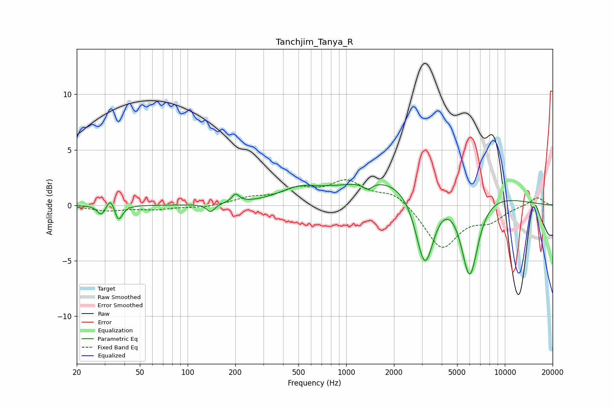

# Tanchjim_Tanya_R
See [usage instructions](https://github.com/jaakkopasanen/AutoEq#usage) for more options and info.

### Parametric EQs
Apply preamp of -2.0 dB when using parametric equalizer.

|   # | Type    |   Fc (Hz) |    Q |   Gain (dB) |
|-----|---------|-----------|------|-------------|
|   1 | Peaking |        29 | 5.97 |        -0.9 |
|   2 | Peaking |        33 | 6    |         1   |
|   3 | Peaking |        37 | 5.91 |        -1.5 |
|   4 | Peaking |       140 | 5.78 |        -0.7 |
|   5 | Peaking |       200 | 6    |         0.8 |
|   6 | Peaking |       497 | 1.19 |         1   |
|   7 | Peaking |      1364 | 4.8  |        -0.6 |
|   8 | Peaking |      2804 | 0.31 |         3.1 |
|   9 | Peaking |      3132 | 2.36 |        -7.4 |
|  10 | Peaking |      5999 | 2.46 |        -7.9 |

### Fixed Band EQs
When using fixed band (also called graphic) equalizer, apply preamp of **-2.4 dB** (if available) and set gains manually with these parameters.

|   # | Type    |   Fc (Hz) |    Q |   Gain (dB) |
|-----|---------|-----------|------|-------------|
|   1 | Peaking |        31 | 1.41 |        -0.5 |
|   2 | Peaking |        62 | 1.41 |        -0.3 |
|   3 | Peaking |       125 | 1.41 |        -0.2 |
|   4 | Peaking |       250 | 1.41 |         0.6 |
|   5 | Peaking |       500 | 1.41 |         1.2 |
|   6 | Peaking |      1000 | 1.41 |         2   |
|   7 | Peaking |      2000 | 1.41 |         1.2 |
|   8 | Peaking |      4000 | 1.41 |        -3.9 |
|   9 | Peaking |      8000 | 1.41 |        -1.2 |
|  10 | Peaking |     16000 | 1.41 |         0.8 |

### Graphs

