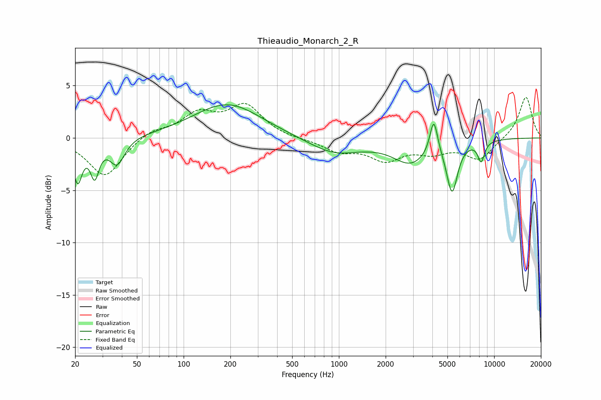

# Thieaudio_Monarch_2_R
See [usage instructions](https://github.com/jaakkopasanen/AutoEq#usage) for more options and info.

### Parametric EQs
Apply preamp of -3.3 dB when using parametric equalizer.

|   # | Type    |   Fc (Hz) |    Q |   Gain (dB) |
|-----|---------|-----------|------|-------------|
|   1 | Peaking |        21 | 4.87 |        -3.9 |
|   2 | Peaking |        27 | 5.08 |        -3.2 |
|   3 | Peaking |        37 | 2.93 |        -2.5 |
|   4 | Peaking |       191 | 0.65 |         3.3 |
|   5 | Peaking |       954 | 0.82 |        -1.6 |
|   6 | Peaking |      1217 | 1.91 |         0.1 |
|   7 | Peaking |      2900 | 1.25 |        -2.2 |
|   8 | Peaking |      4084 | 5.55 |         3.4 |
|   9 | Peaking |      5357 | 3.95 |        -4.7 |
|  10 | Peaking |      8247 | 6    |        -1.9 |

### Fixed Band EQs
When using fixed band (also called graphic) equalizer, apply preamp of **-4.0 dB** (if available) and set gains manually with these parameters.

|   # | Type    |   Fc (Hz) |    Q |   Gain (dB) |
|-----|---------|-----------|------|-------------|
|   1 | Peaking |        31 | 1.41 |        -3.7 |
|   2 | Peaking |        62 | 1.41 |         0.8 |
|   3 | Peaking |       125 | 1.41 |         2.1 |
|   4 | Peaking |       250 | 1.41 |         3   |
|   5 | Peaking |       500 | 1.41 |        -0.1 |
|   6 | Peaking |      1000 | 1.41 |        -1.2 |
|   7 | Peaking |      2000 | 1.41 |        -1.9 |
|   8 | Peaking |      4000 | 1.41 |        -1.1 |
|   9 | Peaking |      8000 | 1.41 |        -2   |
|  10 | Peaking |     16000 | 1.41 |         4   |

### Graphs

