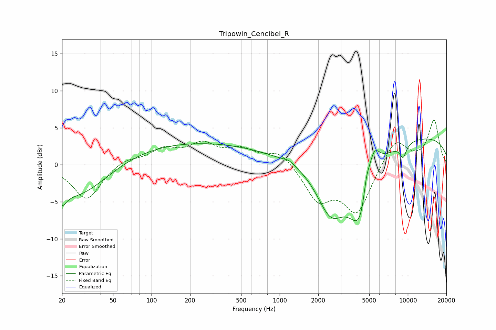

# Tripowin_Cencibel_R
See [usage instructions](https://github.com/jaakkopasanen/AutoEq#usage) for more options and info.

### Parametric EQs
Apply preamp of -3.6 dB when using parametric equalizer.

|   # | Type    |   Fc (Hz) |    Q |   Gain (dB) |
|-----|---------|-----------|------|-------------|
|   1 | Peaking |        20 | 4.42 |        -1.7 |
|   2 | Peaking |        26 | 0.58 |        -4.8 |
|   3 | Peaking |       193 | 0.22 |         3.1 |
|   4 | Peaking |      1185 | 3.56 |         0.4 |
|   5 | Peaking |      2497 | 1.2  |        -7.2 |
|   6 | Peaking |      4339 | 1.42 |       -10.7 |
|   7 | Peaking |      4746 | 5.99 |         2.5 |
|   8 | Peaking |      5371 | 2.62 |         5.7 |
|   9 | Peaking |      9187 | 4.88 |        -1.8 |
|  10 | Peaking |      9802 | 0.18 |         4   |

### Fixed Band EQs
When using fixed band (also called graphic) equalizer, apply preamp of **-6.1 dB** (if available) and set gains manually with these parameters.

|   # | Type    |   Fc (Hz) |    Q |   Gain (dB) |
|-----|---------|-----------|------|-------------|
|   1 | Peaking |        31 | 1.41 |        -4.8 |
|   2 | Peaking |        62 | 1.41 |         0.9 |
|   3 | Peaking |       125 | 1.41 |         1.9 |
|   4 | Peaking |       250 | 1.41 |         2.5 |
|   5 | Peaking |       500 | 1.41 |         1.8 |
|   6 | Peaking |      1000 | 1.41 |         1.9 |
|   7 | Peaking |      2000 | 1.41 |        -4.6 |
|   8 | Peaking |      4000 | 1.41 |        -6.3 |
|   9 | Peaking |      8000 | 1.41 |         3.6 |
|  10 | Peaking |     16000 | 1.41 |         6   |

### Graphs

