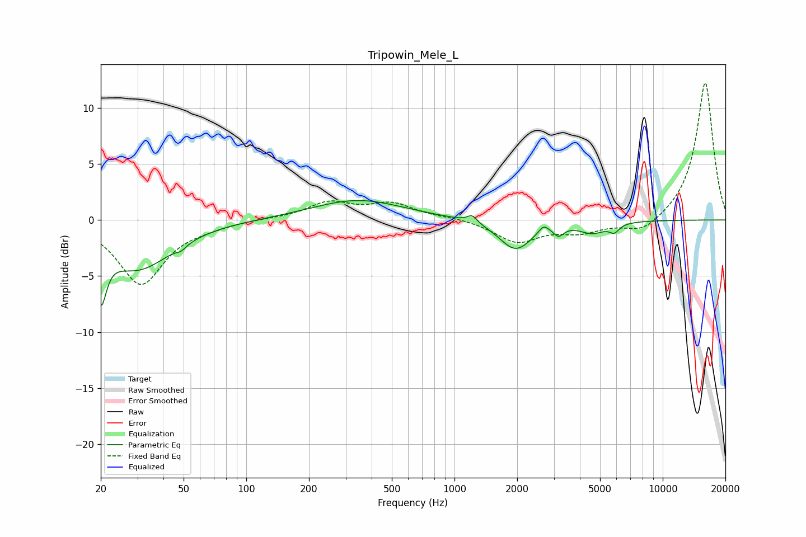

# Tripowin_Mele_L
See [usage instructions](https://github.com/jaakkopasanen/AutoEq#usage) for more options and info.

### Parametric EQs
Apply preamp of -1.8 dB when using parametric equalizer.

|   # | Type    |   Fc (Hz) |    Q |   Gain (dB) |
|-----|---------|-----------|------|-------------|
|   1 | Peaking |        20 | 5.44 |        -4.8 |
|   2 | Peaking |        30 | 0.86 |        -4.3 |
|   3 | Peaking |        49 | 6    |        -0.4 |
|   4 | Peaking |       343 | 0.64 |         1.8 |
|   5 | Peaking |      1216 | 6    |         0.7 |
|   6 | Peaking |      1964 | 1.8  |        -2.7 |
|   7 | Peaking |      2675 | 6    |         0.7 |
|   8 | Peaking |      3163 | 6    |        -0.8 |
|   9 | Peaking |      4604 | 2.22 |        -1   |
|  10 | Peaking |      5849 | 6    |        -0.7 |

### Fixed Band EQs
When using fixed band (also called graphic) equalizer, apply preamp of **-12.3 dB** (if available) and set gains manually with these parameters.

|   # | Type    |   Fc (Hz) |    Q |   Gain (dB) |
|-----|---------|-----------|------|-------------|
|   1 | Peaking |        31 | 1.41 |        -5.7 |
|   2 | Peaking |        62 | 1.41 |        -0.4 |
|   3 | Peaking |       125 | 1.41 |         0.1 |
|   4 | Peaking |       250 | 1.41 |         1.5 |
|   5 | Peaking |       500 | 1.41 |         1.4 |
|   6 | Peaking |      1000 | 1.41 |         0.2 |
|   7 | Peaking |      2000 | 1.41 |        -1.9 |
|   8 | Peaking |      4000 | 1.41 |        -1   |
|   9 | Peaking |      8000 | 1.41 |        -1.3 |
|  10 | Peaking |     16000 | 1.41 |        12.4 |

### Graphs

