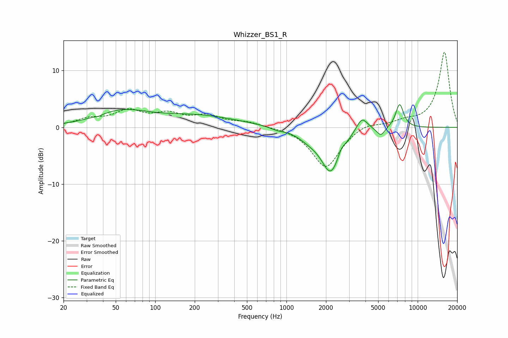

# Whizzer_BS1_R
See [usage instructions](https://github.com/jaakkopasanen/AutoEq#usage) for more options and info.

### Parametric EQs
Apply preamp of -4.1 dB when using parametric equalizer.

|   # | Type    |   Fc (Hz) |    Q |   Gain (dB) |
|-----|---------|-----------|------|-------------|
|   1 | Peaking |        37 | 5.99 |        -0.2 |
|   2 | Peaking |        56 | 0.73 |         2.6 |
|   3 | Peaking |       213 | 0.46 |         1.9 |
|   4 | Peaking |       850 | 2.78 |        -0.4 |
|   5 | Peaking |      1478 | 1.63 |        -1.2 |
|   6 | Peaking |      2176 | 1.9  |        -7.6 |
|   7 | Peaking |      2612 | 6    |         0.9 |
|   8 | Peaking |      3755 | 3.17 |         2.6 |
|   9 | Peaking |      5235 | 4.4  |        -1.5 |
|  10 | Peaking |      7280 | 4.4  |         4.2 |

### Fixed Band EQs
When using fixed band (also called graphic) equalizer, apply preamp of **-13.3 dB** (if available) and set gains manually with these parameters.

|   # | Type    |   Fc (Hz) |    Q |   Gain (dB) |
|-----|---------|-----------|------|-------------|
|   1 | Peaking |        31 | 1.41 |         1.3 |
|   2 | Peaking |        62 | 1.41 |         2.6 |
|   3 | Peaking |       125 | 1.41 |         2   |
|   4 | Peaking |       250 | 1.41 |         1.8 |
|   5 | Peaking |       500 | 1.41 |         0.8 |
|   6 | Peaking |      1000 | 1.41 |         0.1 |
|   7 | Peaking |      2000 | 1.41 |        -7.2 |
|   8 | Peaking |      4000 | 1.41 |         1   |
|   9 | Peaking |      8000 | 1.41 |         0.9 |
|  10 | Peaking |     16000 | 1.41 |        13.3 |

### Graphs

