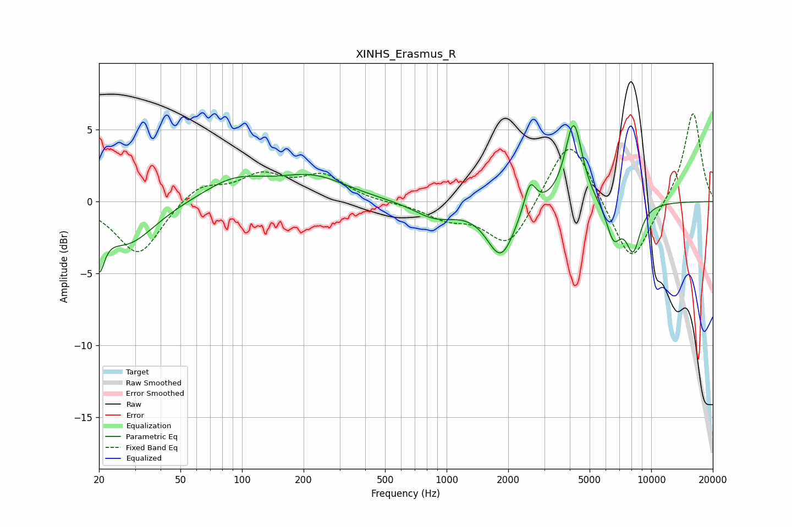

# XINHS_Erasmus_R
See [usage instructions](https://github.com/jaakkopasanen/AutoEq#usage) for more options and info.

### Parametric EQs
Apply preamp of -5.4 dB when using parametric equalizer.

|   # | Type    |   Fc (Hz) |    Q |   Gain (dB) |
|-----|---------|-----------|------|-------------|
|   1 | Peaking |        20 | 5.6  |        -3   |
|   2 | Peaking |        27 | 1.04 |        -3   |
|   3 | Peaking |        92 | 0.92 |         1.5 |
|   4 | Peaking |       222 | 0.83 |         1.6 |
|   5 | Peaking |       878 | 1.34 |        -1.1 |
|   6 | Peaking |      1843 | 2.06 |        -3.7 |
|   7 | Peaking |      2554 | 4.85 |         2.1 |
|   8 | Peaking |      4177 | 3.39 |         5.7 |
|   9 | Peaking |      6551 | 3.68 |        -2.5 |
|  10 | Peaking |      8164 | 3.65 |        -3.2 |

### Fixed Band EQs
When using fixed band (also called graphic) equalizer, apply preamp of **-6.2 dB** (if available) and set gains manually with these parameters.

|   # | Type    |   Fc (Hz) |    Q |   Gain (dB) |
|-----|---------|-----------|------|-------------|
|   1 | Peaking |        31 | 1.41 |        -3.8 |
|   2 | Peaking |        62 | 1.41 |         1.3 |
|   3 | Peaking |       125 | 1.41 |         1.7 |
|   4 | Peaking |       250 | 1.41 |         1.7 |
|   5 | Peaking |       500 | 1.41 |        -0.1 |
|   6 | Peaking |      1000 | 1.41 |        -1   |
|   7 | Peaking |      2000 | 1.41 |        -3.2 |
|   8 | Peaking |      4000 | 1.41 |         4.8 |
|   9 | Peaking |      8000 | 1.41 |        -4.6 |
|  10 | Peaking |     16000 | 1.41 |         6.3 |

### Graphs

