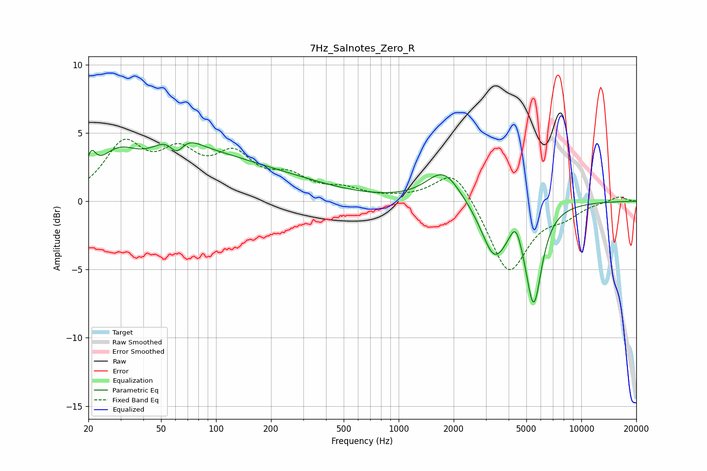

# 7Hz_Salnotes_Zero_R
See [usage instructions](https://github.com/jaakkopasanen/AutoEq#usage) for more options and info.

### Parametric EQs
Apply preamp of -4.4 dB when using parametric equalizer.

|   # | Type    |   Fc (Hz) |    Q |   Gain (dB) |
|-----|---------|-----------|------|-------------|
|   1 | Peaking |        21 | 5.77 |         1.5 |
|   2 | Peaking |        29 | 1.29 |         2.5 |
|   3 | Peaking |        60 | 1.71 |         3.6 |
|   4 | Peaking |        61 | 2.9  |        -2.9 |
|   5 | Peaking |        92 | 0.47 |         2.7 |
|   6 | Peaking |       274 | 0.55 |         0.8 |
|   7 | Peaking |      1763 | 1.52 |         2.4 |
|   8 | Peaking |      3344 | 1.96 |        -3.9 |
|   9 | Peaking |      4372 | 4.65 |         1.4 |
|  10 | Peaking |      5485 | 3.14 |        -7   |

### Fixed Band EQs
When using fixed band (also called graphic) equalizer, apply preamp of **-4.6 dB** (if available) and set gains manually with these parameters.

|   # | Type    |   Fc (Hz) |    Q |   Gain (dB) |
|-----|---------|-----------|------|-------------|
|   1 | Peaking |        31 | 1.41 |         3.9 |
|   2 | Peaking |        62 | 1.41 |         2.9 |
|   3 | Peaking |       125 | 1.41 |         2.9 |
|   4 | Peaking |       250 | 1.41 |         1.5 |
|   5 | Peaking |       500 | 1.41 |         0.7 |
|   6 | Peaking |      1000 | 1.41 |         0.1 |
|   7 | Peaking |      2000 | 1.41 |         2.5 |
|   8 | Peaking |      4000 | 1.41 |        -5.3 |
|   9 | Peaking |      8000 | 1.41 |        -0.9 |
|  10 | Peaking |     16000 | 1.41 |         0.4 |

### Graphs

