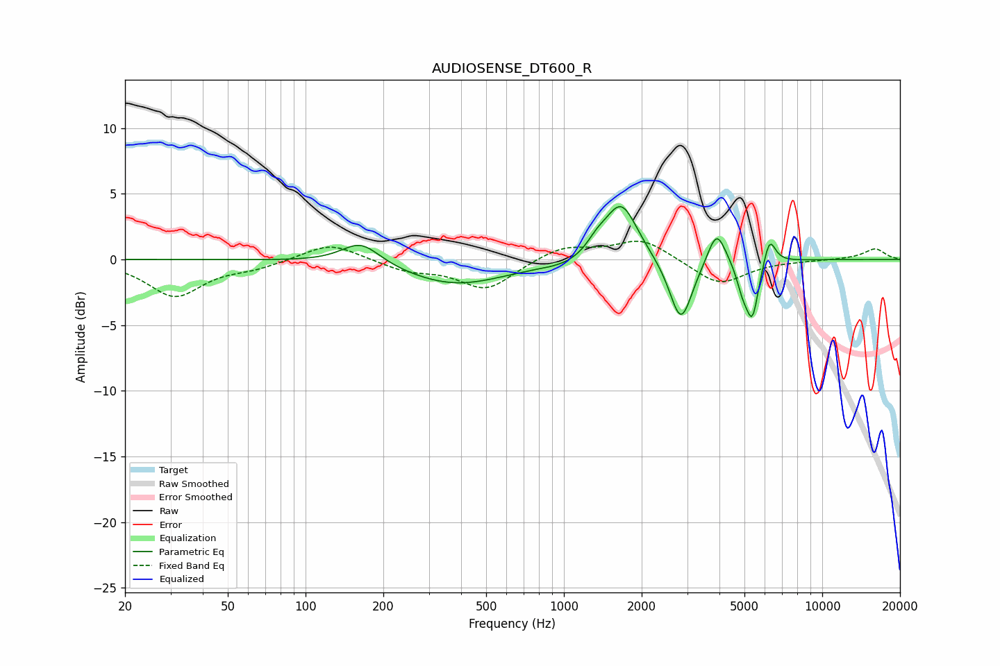

# AUDIOSENSE_DT600_R
See [usage instructions](https://github.com/jaakkopasanen/AutoEq#usage) for more options and info.

### Parametric EQs
Apply preamp of -4.1 dB when using parametric equalizer.

|   # | Type    |   Fc (Hz) |    Q |   Gain (dB) |
|-----|---------|-----------|------|-------------|
|   1 | Peaking |       164 | 1.87 |         1.7 |
|   2 | Peaking |       380 | 0.7  |        -1.9 |
|   3 | Peaking |      1024 | 1.61 |        -0.4 |
|   4 | Peaking |      1344 | 3.58 |         0.8 |
|   5 | Peaking |      1666 | 2.23 |         4.4 |
|   6 | Peaking |      2838 | 3.19 |        -5   |
|   7 | Peaking |      3901 | 4.03 |         2.7 |
|   8 | Peaking |      4908 | 6    |        -1.6 |
|   9 | Peaking |      5363 | 5.61 |        -4.2 |
|  10 | Peaking |      6251 | 6    |         2.1 |

### Fixed Band EQs
When using fixed band (also called graphic) equalizer, apply preamp of **-1.5 dB** (if available) and set gains manually with these parameters.

|   # | Type    |   Fc (Hz) |    Q |   Gain (dB) |
|-----|---------|-----------|------|-------------|
|   1 | Peaking |        31 | 1.41 |        -2.8 |
|   2 | Peaking |        62 | 1.41 |        -0.5 |
|   3 | Peaking |       125 | 1.41 |         1.3 |
|   4 | Peaking |       250 | 1.41 |        -0.8 |
|   5 | Peaking |       500 | 1.41 |        -2.3 |
|   6 | Peaking |      1000 | 1.41 |         1   |
|   7 | Peaking |      2000 | 1.41 |         1.6 |
|   8 | Peaking |      4000 | 1.41 |        -2   |
|   9 | Peaking |      8000 | 1.41 |        -0.1 |
|  10 | Peaking |     16000 | 1.41 |         0.8 |

### Graphs

