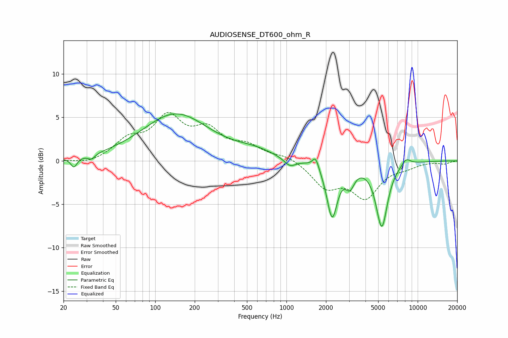

# AUDIOSENSE_DT600_ohm_R
See [usage instructions](https://github.com/jaakkopasanen/AutoEq#usage) for more options and info.

### Parametric EQs
Apply preamp of -5.5 dB when using parametric equalizer.

|   # | Type    |   Fc (Hz) |    Q |   Gain (dB) |
|-----|---------|-----------|------|-------------|
|   1 | Peaking |        24 | 5.95 |        -1.1 |
|   2 | Peaking |        33 | 5.3  |        -0.6 |
|   3 | Peaking |       143 | 0.56 |         5.4 |
|   4 | Peaking |       571 | 0.97 |         0.8 |
|   5 | Peaking |      1062 | 3.13 |        -0.9 |
|   6 | Peaking |      1668 | 6    |         1.4 |
|   7 | Peaking |      2229 | 3.52 |        -6.2 |
|   8 | Peaking |      3047 | 4.13 |        -2   |
|   9 | Peaking |      5326 | 3.14 |        -7.4 |
|  10 | Peaking |      8149 | 3.73 |         0.8 |

### Fixed Band EQs
When using fixed band (also called graphic) equalizer, apply preamp of **-5.7 dB** (if available) and set gains manually with these parameters.

|   # | Type    |   Fc (Hz) |    Q |   Gain (dB) |
|-----|---------|-----------|------|-------------|
|   1 | Peaking |        31 | 1.41 |        -0.5 |
|   2 | Peaking |        62 | 1.41 |         2.1 |
|   3 | Peaking |       125 | 1.41 |         4.6 |
|   4 | Peaking |       250 | 1.41 |         3.1 |
|   5 | Peaking |       500 | 1.41 |         1.5 |
|   6 | Peaking |      1000 | 1.41 |         0.6 |
|   7 | Peaking |      2000 | 1.41 |        -2.8 |
|   8 | Peaking |      4000 | 1.41 |        -3.9 |
|   9 | Peaking |      8000 | 1.41 |        -0.5 |
|  10 | Peaking |     16000 | 1.41 |        -0.3 |

### Graphs

