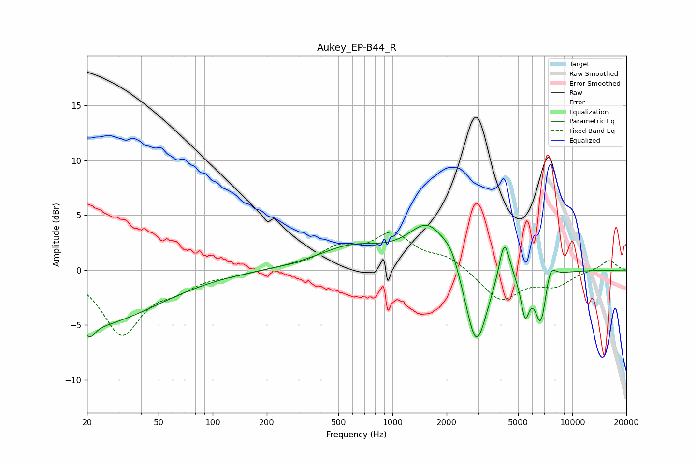

# Aukey_EP-B44_R
See [usage instructions](https://github.com/jaakkopasanen/AutoEq#usage) for more options and info.

### Parametric EQs
Apply preamp of -4.2 dB when using parametric equalizer.

|   # | Type    |   Fc (Hz) |    Q |   Gain (dB) |
|-----|---------|-----------|------|-------------|
|   1 | Peaking |        20 | 0.37 |        -5.1 |
|   2 | Peaking |        21 | 5.16 |        -1   |
|   3 | Peaking |       594 | 0.75 |         2   |
|   4 | Peaking |      1594 | 1.24 |         4.1 |
|   5 | Peaking |      2131 | 3.28 |         1.2 |
|   6 | Peaking |      2920 | 2.28 |        -7.8 |
|   7 | Peaking |      4190 | 4.67 |         4   |
|   8 | Peaking |      5470 | 5.84 |        -3.5 |
|   9 | Peaking |      6689 | 4.2  |        -4.7 |
|  10 | Peaking |      7532 | 4.61 |         1.8 |

### Fixed Band EQs
When using fixed band (also called graphic) equalizer, apply preamp of **-3.6 dB** (if available) and set gains manually with these parameters.

|   # | Type    |   Fc (Hz) |    Q |   Gain (dB) |
|-----|---------|-----------|------|-------------|
|   1 | Peaking |        31 | 1.41 |        -5.7 |
|   2 | Peaking |        62 | 1.41 |        -1.3 |
|   3 | Peaking |       125 | 1.41 |        -0.4 |
|   4 | Peaking |       250 | 1.41 |         0.2 |
|   5 | Peaking |       500 | 1.41 |         1.8 |
|   6 | Peaking |      1000 | 1.41 |         3   |
|   7 | Peaking |      2000 | 1.41 |         1.1 |
|   8 | Peaking |      4000 | 1.41 |        -2.8 |
|   9 | Peaking |      8000 | 1.41 |        -1.3 |
|  10 | Peaking |     16000 | 1.41 |         0.9 |

### Graphs

