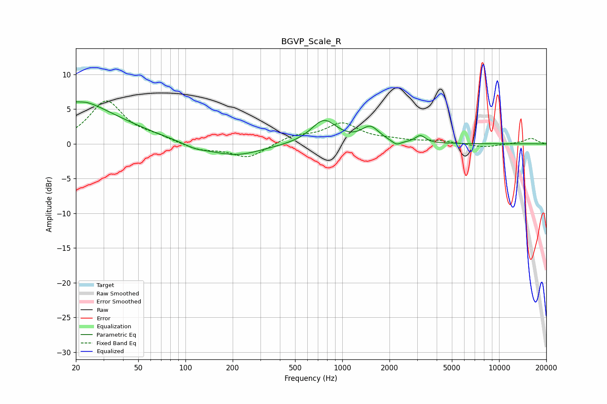

# BGVP_Scale_R
See [usage instructions](https://github.com/jaakkopasanen/AutoEq#usage) for more options and info.

### Parametric EQs
Apply preamp of -6.1 dB when using parametric equalizer.

|   # | Type    |   Fc (Hz) |    Q |   Gain (dB) |
|-----|---------|-----------|------|-------------|
|   1 | Peaking |        20 | 5.7  |         3.4 |
|   2 | Peaking |        20 | 5.59 |        -3.5 |
|   3 | Peaking |        21 | 1.21 |         1.6 |
|   4 | Peaking |        22 | 0.47 |         4.7 |
|   5 | Peaking |       115 | 1.87 |        -0.6 |
|   6 | Peaking |       207 | 0.84 |        -1.8 |
|   7 | Peaking |       764 | 1.75 |         3.4 |
|   8 | Peaking |      1510 | 2.55 |         2.2 |
|   9 | Peaking |      2216 | 4.95 |        -0.7 |
|  10 | Peaking |      3148 | 4.57 |         1.1 |

### Fixed Band EQs
When using fixed band (also called graphic) equalizer, apply preamp of **-6.3 dB** (if available) and set gains manually with these parameters.

|   # | Type    |   Fc (Hz) |    Q |   Gain (dB) |
|-----|---------|-----------|------|-------------|
|   1 | Peaking |        31 | 1.41 |         6.1 |
|   2 | Peaking |        62 | 1.41 |         0.8 |
|   3 | Peaking |       125 | 1.41 |        -0.9 |
|   4 | Peaking |       250 | 1.41 |        -2   |
|   5 | Peaking |       500 | 1.41 |         1.1 |
|   6 | Peaking |      1000 | 1.41 |         2.8 |
|   7 | Peaking |      2000 | 1.41 |         0.4 |
|   8 | Peaking |      4000 | 1.41 |         0.4 |
|   9 | Peaking |      8000 | 1.41 |        -0.5 |
|  10 | Peaking |     16000 | 1.41 |         0.8 |

### Graphs

