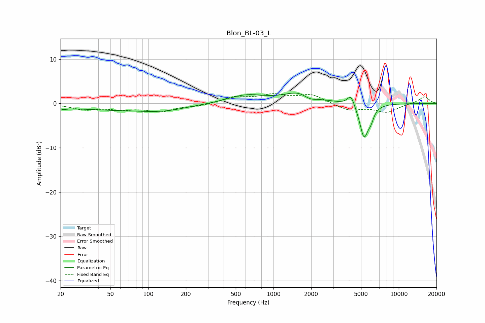

# Blon_BL-03_L
See [usage instructions](https://github.com/jaakkopasanen/AutoEq#usage) for more options and info.

### Parametric EQs
Apply preamp of -2.5 dB when using parametric equalizer.

|   # | Type    |   Fc (Hz) |    Q |   Gain (dB) |
|-----|---------|-----------|------|-------------|
|   1 | Peaking |        21 | 5.43 |        -0.4 |
|   2 | Peaking |        25 | 2.48 |        -0.1 |
|   3 | Peaking |        56 | 0.33 |        -1.4 |
|   4 | Peaking |       135 | 0.84 |        -0.8 |
|   5 | Peaking |       605 | 0.95 |         1.8 |
|   6 | Peaking |      1677 | 1.17 |         2.9 |
|   7 | Peaking |      1939 | 2.25 |        -1.6 |
|   8 | Peaking |      4153 | 4.84 |         2.6 |
|   9 | Peaking |      5281 | 3.93 |        -7.6 |
|  10 | Peaking |      5993 | 5.84 |        -1.9 |

### Fixed Band EQs
When using fixed band (also called graphic) equalizer, apply preamp of **-2.3 dB** (if available) and set gains manually with these parameters.

|   # | Type    |   Fc (Hz) |    Q |   Gain (dB) |
|-----|---------|-----------|------|-------------|
|   1 | Peaking |        31 | 1.41 |        -1.3 |
|   2 | Peaking |        62 | 1.41 |        -1.1 |
|   3 | Peaking |       125 | 1.41 |        -1.6 |
|   4 | Peaking |       250 | 1.41 |        -0.5 |
|   5 | Peaking |       500 | 1.41 |         1.4 |
|   6 | Peaking |      1000 | 1.41 |         1.7 |
|   7 | Peaking |      2000 | 1.41 |         1.9 |
|   8 | Peaking |      4000 | 1.41 |        -1.6 |
|   9 | Peaking |      8000 | 1.41 |        -1.9 |
|  10 | Peaking |     16000 | 1.41 |         1.6 |

### Graphs

