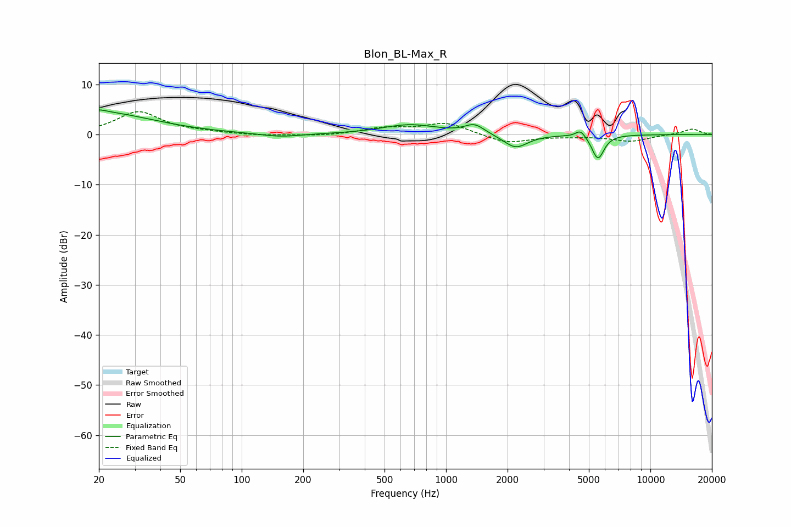

# Blon_BL-Max_R
See [usage instructions](https://github.com/jaakkopasanen/AutoEq#usage) for more options and info.

### Parametric EQs
Apply preamp of -5.0 dB when using parametric equalizer.

|   # | Type    |   Fc (Hz) |    Q |   Gain (dB) |
|-----|---------|-----------|------|-------------|
|   1 | Peaking |        20 | 4.12 |         0.5 |
|   2 | Peaking |        20 | 0.55 |         4.4 |
|   3 | Peaking |       154 | 1.47 |        -0.7 |
|   4 | Peaking |       611 | 1.23 |        -0.1 |
|   5 | Peaking |       662 | 1.04 |         2   |
|   6 | Peaking |      1378 | 2.95 |         1.9 |
|   7 | Peaking |      2190 | 2.39 |        -2.8 |
|   8 | Peaking |      4554 | 5.88 |         1.5 |
|   9 | Peaking |      5378 | 5.95 |        -0.7 |
|  10 | Peaking |      5572 | 4.82 |        -4.2 |

### Fixed Band EQs
When using fixed band (also called graphic) equalizer, apply preamp of **-4.6 dB** (if available) and set gains manually with these parameters.

|   # | Type    |   Fc (Hz) |    Q |   Gain (dB) |
|-----|---------|-----------|------|-------------|
|   1 | Peaking |        31 | 1.41 |         4.5 |
|   2 | Peaking |        62 | 1.41 |         0.3 |
|   3 | Peaking |       125 | 1.41 |        -0.3 |
|   4 | Peaking |       250 | 1.41 |        -0.3 |
|   5 | Peaking |       500 | 1.41 |         1.2 |
|   6 | Peaking |      1000 | 1.41 |         2.3 |
|   7 | Peaking |      2000 | 1.41 |        -1.8 |
|   8 | Peaking |      4000 | 1.41 |        -0.3 |
|   9 | Peaking |      8000 | 1.41 |        -1.3 |
|  10 | Peaking |     16000 | 1.41 |         1.1 |

### Graphs

