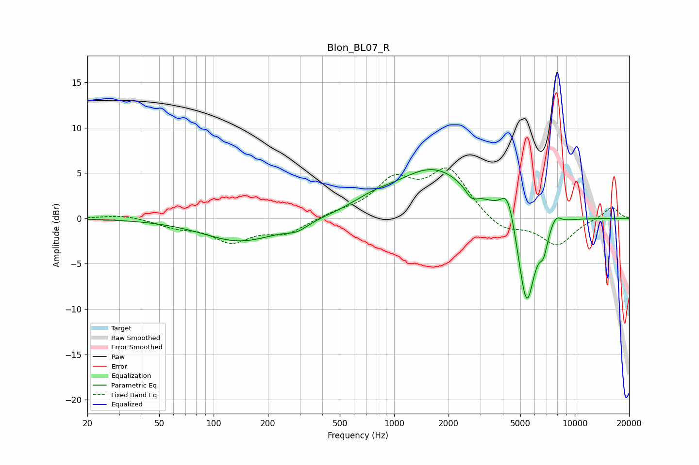

# Blon_BL07_R
See [usage instructions](https://github.com/jaakkopasanen/AutoEq#usage) for more options and info.

### Parametric EQs
Apply preamp of -5.5 dB when using parametric equalizer.

|   # | Type    |   Fc (Hz) |    Q |   Gain (dB) |
|-----|---------|-----------|------|-------------|
|   1 | Peaking |       141 | 0.68 |        -2.5 |
|   2 | Peaking |       289 | 2.38 |        -0.8 |
|   3 | Peaking |       755 | 1.19 |         1   |
|   4 | Peaking |      1657 | 0.67 |         5.4 |
|   5 | Peaking |      2685 | 4.11 |        -1.2 |
|   6 | Peaking |      4253 | 3.63 |         3.3 |
|   7 | Peaking |      5109 | 3.76 |        -0.8 |
|   8 | Peaking |      5432 | 3.01 |        -9.7 |
|   9 | Peaking |      6715 | 5.99 |        -2.2 |
|  10 | Peaking |      7858 | 4.57 |         1.1 |

### Fixed Band EQs
When using fixed band (also called graphic) equalizer, apply preamp of **-5.7 dB** (if available) and set gains manually with these parameters.

|   # | Type    |   Fc (Hz) |    Q |   Gain (dB) |
|-----|---------|-----------|------|-------------|
|   1 | Peaking |        31 | 1.41 |         0.4 |
|   2 | Peaking |        62 | 1.41 |        -0.8 |
|   3 | Peaking |       125 | 1.41 |        -2.4 |
|   4 | Peaking |       250 | 1.41 |        -1.6 |
|   5 | Peaking |       500 | 1.41 |         0.5 |
|   6 | Peaking |      1000 | 1.41 |         3.9 |
|   7 | Peaking |      2000 | 1.41 |         5.1 |
|   8 | Peaking |      4000 | 1.41 |        -1.5 |
|   9 | Peaking |      8000 | 1.41 |        -2.9 |
|  10 | Peaking |     16000 | 1.41 |         1.3 |

### Graphs

