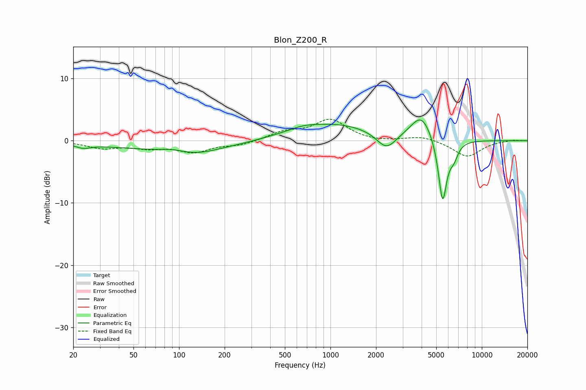

# Blon_Z200_R
See [usage instructions](https://github.com/jaakkopasanen/AutoEq#usage) for more options and info.

### Parametric EQs
Apply preamp of -3.4 dB when using parametric equalizer.

|   # | Type    |   Fc (Hz) |    Q |   Gain (dB) |
|-----|---------|-----------|------|-------------|
|   1 | Peaking |        23 | 2.98 |        -0.6 |
|   2 | Peaking |        88 | 2.25 |         0.3 |
|   3 | Peaking |        96 | 0.29 |        -1.4 |
|   4 | Peaking |       134 | 1.12 |        -0.8 |
|   5 | Peaking |       657 | 1.86 |         0.4 |
|   6 | Peaking |      1012 | 0.48 |         2.8 |
|   7 | Peaking |      2343 | 2.13 |        -2.8 |
|   8 | Peaking |      3999 | 1.98 |         4.1 |
|   9 | Peaking |      5508 | 4.76 |       -10.5 |
|  10 | Peaking |      6532 | 4.8  |        -2   |

### Fixed Band EQs
When using fixed band (also called graphic) equalizer, apply preamp of **-3.6 dB** (if available) and set gains manually with these parameters.

|   # | Type    |   Fc (Hz) |    Q |   Gain (dB) |
|-----|---------|-----------|------|-------------|
|   1 | Peaking |        31 | 1.41 |        -1.1 |
|   2 | Peaking |        62 | 1.41 |        -1   |
|   3 | Peaking |       125 | 1.41 |        -1.7 |
|   4 | Peaking |       250 | 1.41 |        -0.7 |
|   5 | Peaking |       500 | 1.41 |         1.3 |
|   6 | Peaking |      1000 | 1.41 |         3.3 |
|   7 | Peaking |      2000 | 1.41 |        -0.3 |
|   8 | Peaking |      4000 | 1.41 |         0.8 |
|   9 | Peaking |      8000 | 1.41 |        -2.6 |
|  10 | Peaking |     16000 | 1.41 |         0.2 |

### Graphs

